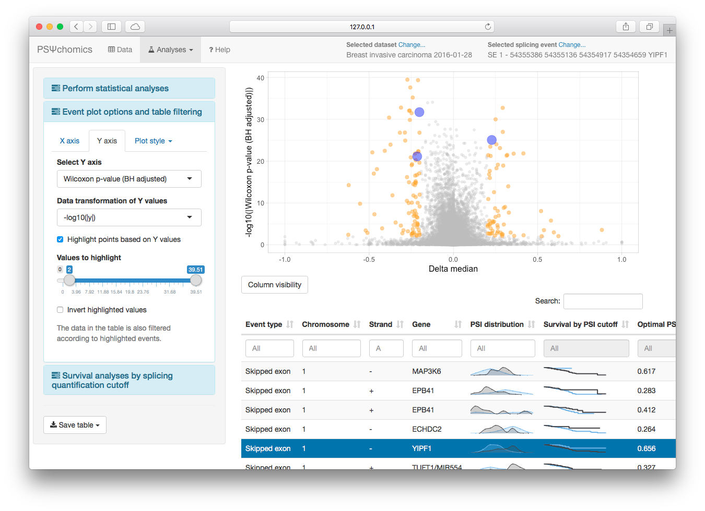

# psichomics [![Build Status][travisIcon]][travis] [![AppVeyor Build Status][appVeyorIcon]][appVeyor] [![codecov][codecovIcon]][codecov]

> **Original article:**
>
> Nuno Saraiva-Agostinho and Nuno L. Barbosa-Morais (2018). 
[psichomics: graphical application for alternative splicing quantification and analysis][article].
*Nucleic Acids Research*.

Interactive R package with an intuitive Shiny-based graphical 
interface for alternative splicing quantification and integrative analyses of
alternative splicing and gene expression based on 
[The Cancer Genome Atlas (TCGA)][TCGA], the 
[Genotype-Tissue Expression (GTEx) project][GTEx], 
[Sequence Read Archive (SRA)][SRA] and user-provided data.

*psichomics* interactively performs survival, dimensionality reduction and 
median- and variance-based differential splicing and gene expression 
analyses that benefit from the incorporation of clinical and molecular 
sample-associated features (such as tumour stage or survival). Interactive
visual access to genomic mapping and functional annotation of selected 
alternative splicing events is also included.



## Table of Contents

* [Install and start running](#install-and-start-running)
    * [Bioconductor release](#bioconductor-release)
    * [GitHub version](#github-version)
* [Tutorials](#tutorials)
* [Data input](#data-input)
    * [Download TCGA data](#download-tcga-data)
    * [Load GTEx data](#load-gtex-data)
    * [Load SRA data](#load-sra-data)
    * [Load user-provided files](#load-user-provided-files)
* [Splicing quantification](#splicing-quantification)
* [Gene expression processing](#gene-expression-processing)
* [Data analyses](#data-analyses)
    * [Differential splicing and gene expression analysis](#differential-splicing-and-gene-expression-analysis)
    * [Dimensionality reduction](#dimensionality-reduction)
    * [Survival analysis](#survival-analysis)
    * [Gene, transcript and protein information](#gene-transcript-and-protein-information)
    * [Correlation between gene expression and splicing quantification](#correlation-between-gene-expression-and-splicing-quantification)
* [Data grouping](#data-grouping)
* [Feedback and support](#feedback-and-support)
* [Contributions](#contributions)
* [References](#references)

## Install and start running

### Bioconductor release

To install the package from [Bioconductor][bioconductor], type the following in 
[RStudio][rstudio] or in an R console:

```r
install.packages("BiocManager")
BiocManager::install("psichomics")
```

### GitHub version

To install and start using the GitHub version (that may be updated faster than
its Bioconductor counterpart), follow the following steps:

1. [Install R][r]
2. Depending on your operative system, install:
    - [Rtools](https://cran.r-project.org/bin/windows/Rtools/) (Windows)
    - [Xcode command-line tools](https://developer.apple.com/downloads) (Mac)
    - **r-devel** or **r-base-dev** (Linux)
3. Open [RStudio][rstudio] or an R console
4. Install [Bioconductor][bioconductor] with: 
    - `install.packages("BiocManager")`
5. Install, load and start the visual interface with:
```r
install.packages("devtools")
devtools::install_github("nuno-agostinho/psichomics")
library(psichomics)
psichomics()
```

#### Running the latest versions of *psichomics* in R 3.2 or newer

If you prefer to run *psichomics* in an older R version (3.2 or newer), run the
following commands (note that the newest versions of *psichomics* were not 
tested in older R versions and some features may not be supported):
```r
install.packages("devtools")
devtools::install_github("nuno-agostinho/psichomics", ref="R3.2")
library(psichomics)
psichomics()
```

## Tutorials

The following case studies and tutorials are available and were based on our 
[original article][article] (currently in preprint):

* [Visual interface][tutorial-gui]
* [Command-line interface][tutorial-cli]
* [Loading SRA and user-provided RNA-seq data][tutorial-custom-data]
* [Preparing alternative splicing annotations][tutorial-prep-AS-annotation]

## Data input

### Download TCGA Data

Pre-processed data of given tumours of interest can be automatically downloaded 
from [TCGA][TCGA]. Subject- and sample-associated information, junction 
quantification and gene expression data from TCGA are supported.

### Load GTEx Data

GTEx data needs to be manually downloaded from the [GTEx Portal][GTEx]. Subject- 
and sample-associated data, junction quantification and gene expression data 
from GTEx are supported.

### Load SRA Data

Although only select [SRA][SRA] projects are available to be automatically
downloaded (based on pre-processed data from the [recount2][recount2] project), 
other SRA projects can be manually downloaded, aligned using a splice-aware 
aligner and loaded by the user, as per the instructions in
[Loading SRA and user-provided RNA-seq data][tutorial-custom-data]. 
Sample-associated files from SRA are also supported.

### Load user-provided files

User-provided files (including subject-associated data, sample-associated data, 
junction quantification, alternative splicing quantification and gene 
expression) can be loaded as per the instructions in
[Loading SRA and user-provided RNA-seq data][tutorial-custom-data].

## Splicing quantification

The quantification of each alternative splicing event is based on the proportion
of junction reads that support the inclusion isoform, known as percent 
spliced-in or PSI [(Wang *et al.*, 2008)][Wang2008].

An estimate of this value is obtained based on the the proportion of reads 
supporting the inclusion of an exon over the reads supporting both the inclusion
and exclusion of that exon. To measure this estimate, both alternative splicing 
annotation and the quantification of RNA-Seq reads aligning to splice junctions
(junction quantification) are required. While alternative splicing Human (hg19
and hg38 assemblies) annotation is provided within the package, junction 
quantification may be handed by the user or retrieved from [TCGA][TCGA], 
[GTEx][GTEx] and [SRA][SRA].

## Gene expression processing

Gene expression can be normalised, filtered and log2-transformed in-app.
Alternatively, the user can also provide its own pre-processed gene expression 
file.

## Data grouping

Molecular and clinical sample-associated attributes allow to establish groups 
that can be explored in data analyses. For instance, [TCGA][TCGA] data can be 
analysed based on smoking history, gender and race, among other attributes. 
Groups can also be manipulated (e.g. merged, intersected, etc.), allowing for 
complex attribute combinations, as well as saved and loaded between sessions.

## Data Analyses

### Dimensionality reduction

Perform principal and independent component analysis (PCA and ICA, respectively)
on alternative splicing quantification and gene expression based on the 
previously created groups.

### Differential splicing and gene expression analysis

Analyse alternative splicing quantification (based on variance and median 
statistical tests) and gene expression data based on the previously created
groups.

### Correlation between gene expression and splicing quantification

Test the correlation betweem the gene expression of a specific gene with the
alternative splicing quantification of selected alternative splicing events.

### Survival analysis

Perform Kaplan-Meier curves and Cox models based on sample-associated features. 
Additionally, study the impact of a splicing event (based on its quantification)
or a gene (based on its gene expression) on patient survivability.

### Gene, transcript and protein information

Examine the annotation and corresponding transcripts and proteins for a gene of
interest. Relevant research articles are also presented here.

## Feedback and support

All feedback on the program, documentation and associated material is welcome. 
Please send any suggestions and comments to:

> Nuno Saraiva-Agostinho ([nunoagostinho@medicina.ulisboa.pt](mailto:nunoagostinho@medicina.ulisboa.pt))
> 
> [Disease Transcriptomics Lab, Instituto de Medicina Molecular (Portugal)][NMorais]

## Contributions

Please note that this project is released with a 
[Contributor Code of Conduct][conduct]. By participating in this project you 
agree to abide by its terms.

## References

Wang, E. T., R. Sandberg, S. Luo, I. Khrebtukova, L. Zhang, C. Mayr, S. F. 
Kingsmore, G. P. Schroth, and C. B. Burge. 2008. 
[*Alternative isoform regulation in human tissue transcriptomes.*][Wang2008] 
Nature 456 (7221): 470–76.

[TCGA]: https://tcga-data.nci.nih.gov
[bioconductor]: https://www.bioconductor.org
[r]: https://www.r-project.org
[rstudio]: https://www.rstudio.com/products/rstudio
[NMorais]: http://imm.medicina.ulisboa.pt/group/distrans/
[conduct]: CONDUCT.md
[Wang2008]: http://www.nature.com/nature/journal/v456/n7221/full/nature07509.html
[travisIcon]: https://travis-ci.org/nuno-agostinho/psichomics.svg?branch=master
[travis]: https://travis-ci.org/nuno-agostinho/psichomics
[appVeyorIcon]: https://ci.appveyor.com/api/projects/status/github/nuno-agostinho/psichomics?branch=master&svg=true
[appVeyor]: https://ci.appveyor.com/project/nuno-agostinho/psichomics
[codecovIcon]: https://codecov.io/gh/nuno-agostinho/psichomics/branch/master/graph/badge.svg
[codecov]: https://codecov.io/gh/nuno-agostinho/psichomics
[GTEx]: http://www.gtexportal.org
[article]: https://doi.org/10.1093/nar/gky888
[SRA]: https://www.ncbi.nlm.nih.gov/sra
[tutorial-gui]: http://rpubs.com/nuno-agostinho/psichomics-tutorial-visual
[tutorial-cli]: http://rpubs.com/nuno-agostinho/psichomics-cli-tutorial
[tutorial-custom-data]: http://rpubs.com/nuno-agostinho/psichomics-custom-data
[tutorial-prep-AS-annotation]: http://rpubs.com/nuno-agostinho/preparing-AS-annotation
[recount2]: https://jhubiostatistics.shinyapps.io/recount/
