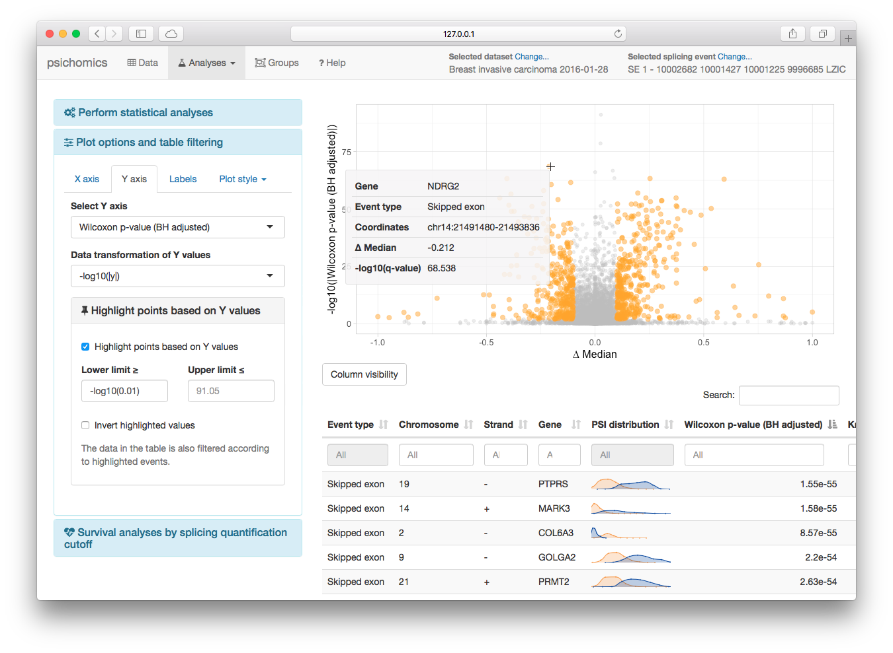

# psichomics [![Build Status][8]][9] [![AppVeyor Build Status][10]][11] [![codecov][12]][13]

Interactive R package with an intuitive Shiny-based graphical 
interface for alternative splicing quantification and integrative analyses of
alternative splicing and gene expression from large transcriptomic datasets, 
including those from [The Cancer Genome Atlas (TCGA)][1] and 
[Genotype-Tissue Expression (GTEx) project][13], as well as user-owned data.

The tool interactively performs survival, dimensionality reduction and median- 
and variance-based differential splicing and gene expression analyses that 
benefit from the incorporation of clinical and molecular sample-associated 
features (such as tumour stage or survival). Interactive visual access to 
genomic mapping and functional annotation of selected alternative splicing 
events is also included.



## Table of Contents

* [Install and start running](#install-and-start-running)
    * [Bioconductor release](#bioconductor-release)
    * [Development version](#development-version)
* [Tutorials](#tutorials)
* [Data input](#data-input)
    * [Download TCGA data](#download-tcga-data)
    * [Load GTEx data](#load-gtex-data)
    * [Load user-provided files](#load-user-provided-files)
* [Splicing quantification](#splicing-quantification)
* [Gene expression processing](#gene-expression-processing)
* [Data analyses](#data-analyses)
    * [Differential splicing and gene expression analysis](#differential-splicing-and-gene-expression-analysis)
    * [Dimensionality reduction](#dimensionality-reduction)
    * [Survival analysis](#survival-analysis)
    * [Gene, transcript and protein information](#gene-transcript-and-protein-information)
    * [Correlation between gene expression and splicing quantification](#correlation-between-gene-expression-and-splicing-quantification)
* [Data grouping](#data-grouping)
* [Feedback](#feedback)
* [Contributions](#contributions)
* [References](#references)

## Install and start running

### Bioconductor release

To install the package from [Bioconductor][2], type the following in 
[RStudio][4] or in an R console:

```r
## try http:// if https:// URLs are not supported
source("https://bioconductor.org/biocLite.R")
biocLite("psichomics")
```

### Development version

To install and start using the development version, follow these steps:

1. [Install R][3]
2. Depending on your operative system, install:
    - [Rtools](https://cran.r-project.org/bin/windows/Rtools/) (Windows)
    - [Xcode command-line tools](https://developer.apple.com/downloads) (Mac)
    - **r-devel** or **r-base-dev** (Linux)
3. Open [RStudio][4] or an R console
4. Install [Bioconductor][2] with: 
    - `source("https://bioconductor.org/biocLite.R")`
5. Install, load and start the visual interface with:
```r
install.packages("devtools")
devtools::install_github("nuno-agostinho/psichomics")
library(psichomics)
psichomics()
```

## Tutorials

The following tutorials are available:

* [Visual interface](http://rpubs.com/nuno-agostinho/psichomics-tutorial-visual)
* [Command-line interface](http://rpubs.com/nuno-agostinho/psichomics-cli-tutorial)

Other tutorials coming soon:

* Developers and other contributors

## Data input

### Download TCGA Data

psichomics allows to download data from the [TCGA][1] after selecting the tumour
of interest. Subject- and sample-associated information, junction quantification
and gene expression data from TCGA are supported.

### Load GTEx Data

GTEx data needs to be manually downloaded from the [GTEx Portal][13]. Subject- 
and sample-associated data, junction quantification and gene expression data 
from GTEx are supported.

### Load user-provided files

psichomics contains instructions to load user-owned files (including
subject-associated data, sample-associated data, junction quantification,
alternative splicing quantification and gene expression).

## Splicing quantification

The quantification of each alternative splicing event is based on the proportion
of junction reads that support the inclusion isoform, known as percent 
spliced-in or PSI [(Wang *et al.*, 2008)](#references).

An estimate of this value is obtained based on the the proportion of reads 
supporting the inclusion of an exon over the reads supporting both the inclusion
and exclusion of that exon. To measure this estimate, both alternative splicing 
annotation and the quantification of RNA-Seq reads aligning to splice junctions
(junction quantification) are required. While alternative splicing Human (hg19
assembly) annotation is provided by the package, junction quantification may be
retrieved from [TCGA][1] (automatically) or from [GTEx][14] (manually).

## Gene expression processing

Gene expression can be normalised, filtered and log2-transformed in-app.
Alternatively, the user can also provide its own pre-processed gene expression 
file.

## Data Analyses

The program performs survival analysis and dimensionality reduction, as well as
differential splicing and gene expression analysis.

### Dimensionality reduction

Perform principal and independent component analysis (PCA and ICA, respectively)
on alternative splicing quantification and gene expression based on molecular
and clinical sample-associated attributes.

### Differential splicing and gene expression analysis

Analyse alternative splicing quantification based on variance and median 
statistical tests. The groups available for differential analysis comprise 
molecular and clinical sample-associated features.

### Survival analysis

Perform Kaplan-Meier curves and Cox models based on sample-associated features. 
Additionally, study the impact of a splicing event (based on its quantification)
or a gene (based on its gene expression) on patient survivability.

### Gene, transcript and protein information

Examine the annotation and corresponding transcripts and proteins for a gene of
interest. Relevant research articles are also available.

### Correlation between gene expression and splicing quantification

Test the correlation betweem the gene expression of a specific gene with the
alternative splicing quantification of selected alternative splicing events.

## Data grouping

Subject- and sample-associated data allow to establish groups that can be 
exploited in diverse analyses throughout psichomics.

- **By attribute:** automatically create groups by selecting a specific
attribute of the dataset; for instance, to create a group for each tumour stage,
start typing `tumor_stage`, select the appropriate field from the suggestions,
click on `Create group` and confirm that there is now one group for each stage.
- **By index or identifiers:** input specific index or identifiers to create a
group
- **By subset expression:** filter attributes based on flexible subset 
expressions
- **By regular expression:** apply a regular expression over a specific 
attribute

Groups can also be selected in order to be manipulated (e.g. merged, 
intersected, etc.), removed or renamed.

## Feedback

All feedback on the program, documentation and associated material is welcome. 
Please, send any suggestions and comments to the following contact:

> Nuno Saraiva-Agostinho (nunodanielagostinho@gmail.com)

> [Nuno Morais Lab, Instituto de Medicina Molecular][5]

## Contributions

Please note that this project is released with a 
[Contributor Code of Conduct][6]. By participating in this project you agree to
abide by its terms.

## References

Wang, E. T., R. Sandberg, S. Luo, I. Khrebtukova, L. Zhang, C. Mayr, S. F. 
Kingsmore, G. P. Schroth, and C. B. Burge. 2008. 
[*Alternative isoform regulation in human tissue transcriptomes.*][7] Nature 456
(7221): 470–76.

[1]: https://tcga-data.nci.nih.gov
[2]: https://www.bioconductor.org
[3]: https://www.r-project.org
[4]: https://www.rstudio.com/products/rstudio
[5]: http://imm.medicina.ulisboa.pt/group/compbio
[6]: CONDUCT.md
[7]: http://www.nature.com/nature/journal/v456/n7221/full/nature07509.html
[8]: https://travis-ci.org/nuno-agostinho/psichomics.svg?branch=master
[9]: https://travis-ci.org/nuno-agostinho/psichomics
[10]: https://ci.appveyor.com/api/projects/status/github/nuno-agostinho/psichomics?branch=master&svg=true
[11]: https://ci.appveyor.com/project/nuno-agostinho/psichomics
[12]: https://codecov.io/gh/nuno-agostinho/psichomics/branch/master/graph/badge.svg
[13]: https://codecov.io/gh/nuno-agostinho/psichomics
[14]: http://www.gtexportal.org
