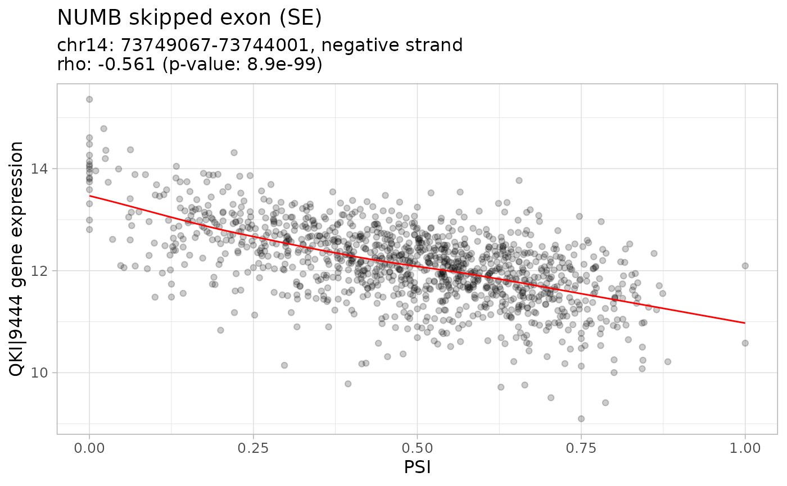

# Case study: command-line interface (CLI) tutorial

*psichomics* is an interactive R package for integrative analyses of
alternative splicing and gene expression based on [The Cancer Genome
Atlas (TCGA)](https://tcga-data.nci.nih.gov/docs/publications/tcga)
(containing molecular data associated with 34 tumour types), the
[Genotype-Tissue Expression (GTEx)](http://gtexportal.org) project
(containing data for multiple normal human tissues), [Sequence Read
Archive (SRA)](https://www.ncbi.nlm.nih.gov/sra) and user-provided data.
The data from GTEx, TCGA and select SRA projects include
subject/sample-associated information and transcriptomic data, such as
the quantification of RNA-Seq reads aligning to splice junctions
(henceforth called junction quantification) and exons.

## Installing and starting the program

Install *psichomics* by typing the following in an R console (the [R
environment](https://www.r-project.org/) is required):

``` r
install.packages("BiocManager")
BiocManager::install("psichomics")
```

After the installation, load psichomics by typing:

``` r
library(psichomics)
```

## Quick reference of psichomics functions

Please read the following [function
reference](https://nuno-agostinho.github.io/psichomics/reference).

## Exploration of clinically-relevant, differentially spliced events in breast cancer

> The following case study was adapted from *psichomics*’ original
> article:
>
> Nuno Saraiva-Agostinho and Nuno L. Barbosa-Morais (2019).
> **[psichomics: graphical application for alternative splicing
> quantification and analysis](https://doi.org/10.1093/nar/gky888)**.
> *Nucleic Acids Research*.

Breast cancer is the cancer type with the highest incidence and
mortality in women (Torre *et al.*, 2015) and multiple studies have
suggested that transcriptome-wide analyses of alternative splicing
changes in breast tumours are able to uncover tumour-specific biomarkers
(Tsai *et al.*, 2015; Danan-Gotthold *et al.*, 2015; Anczuków *et al.*,
2015). Given the relevance of early detection of breast cancer to
patient survival, we can use *psichomics* to identify novel tumour
stage-I-specific molecular signatures based on differentially spliced
events.

### Downloading and loading TCGA data

The quantification of each alternative splicing event is based on the
proportion of junction reads that support the inclusion isoform, known
as percent spliced-in or PSI (Wang *et al.*, 2008).

To estimate this value for each splicing event, both alternative
splicing annotation and junction quantification are required. While
alternative splicing annotation is provided by the package, junction
quantification may be retrieved from
[TCGA](https://tcga-data.nci.nih.gov/docs/publications/tcga),
[GTEx](http://gtexportal.org), [SRA](https://www.ncbi.nlm.nih.gov/sra)
or user-provided files.

Data is downloaded from [FireBrowse](http://firebrowse.org), a service
that hosts processed data from
[TCGA](https://tcga-data.nci.nih.gov/docs/publications/tcga), as
required to run the downstream analyses. Before downloading data, check
the following options:

``` r
# Available tumour types
cohorts <- getFirebrowseCohorts()

# Available sample dates
date <- getFirebrowseDates()

# Available data types
dataTypes <- getFirebrowseDataTypes()
```

> Note there is also the option for *Gene expression (normalised by
> RSEM)*. However, we recommend to load the raw gene expression data
> instead, followed by filtering and normalisation as demonstrated
> afterwards.

After deciding on the options to use, download and load breast cancer
data as follows:

``` r
# Set download folder
folder <- getDownloadsFolder()

# Download and load most recent junction quantification and clinical data from
# TCGA/FireBrowse for Breast Cancer
data <- loadFirebrowseData(folder=folder,
                           cohort="BRCA",
                           data=c("clinical", "junction_quantification",
                                  "RSEM_genes"),
                           date="2016-01-28")
names(data)
names(data[[1]])

# Select clinical and junction quantification dataset
clinical      <- data[[1]]$`Clinical data`
sampleInfo    <- data[[1]]$`Sample metadata`
junctionQuant <- data[[1]]$`Junction quantification (Illumina HiSeq)`
geneExpr      <- data[[1]]$`Gene expression`
```

Data is only downloaded if the files are not present in the given
folder. In other words, if the files were already downloaded, the
function will just load the files, so it is possible to reuse the code
above just to load the requested files.

> **Windows limitations**: If you are using *Windows*, note that the
> downloaded files have huge names that may be over [*Windows* Maximum
> Path
> Length](https://msdn.microsoft.com/library/windows/desktop/aa365247.aspx#maxpath).
> A workaround would be to manually rename the downloaded files to have
> shorter names, move all downloaded files to a single folder and load
> such folder.

### Filtering and normalising gene expression

As this package does not focuses on gene expression analysis, we suggest
to read the RNA-seq section of `limma`’s user guide. Nevertheless, we
present the following commands to quickly filter and normalise gene
expression:

``` r
# Check genes with 10 or more counts in at least some samples and 15 or more
# total counts across all samples
filter <- filterGeneExpr(geneExpr, minCounts=10, minTotalCounts=15)

# What normaliseGeneExpression() does:
# 1) Filter gene expression based on its argument "geneFilter"
# 2) Normalise gene expression with edgeR::calcNormFactors (internally) using
#    the trimmed mean of M-values (TMM) method (by default)
# 3) Calculate log2-counts per million (logCPM)
geneExprNorm <- normaliseGeneExpression(geneExpr,
                                        geneFilter=filter,
                                        method="TMM",
                                        log2transform=TRUE)
```

### Quantifying alternative splicing

After loading the clinical and alternative splicing junction
quantification data from TCGA, quantify alternative splicing by clicking
the green panel **Alternative splicing quantification**.

As previously mentioned, alternative splicing is quantified from the
previously loaded junction quantification and an alternative splicing
annotation file. To check current annotation files available:

``` r
# Available alternative splicing annotation
annotList <- listSplicingAnnotations()
annotList
```

    ##                                            Human hg19 (2016-10-11) 
    ##                                                          "AH51461" 
    ##                                            Human hg19 (2017-10-20) 
    ##                                                          "AH60272" 
    ##                                            Human hg38 (2018-04-30) 
    ##                                                          "AH63657" 
    ##                            Human hg19 from VAST-TOOLS (2021-06-15) 
    ##                                                          "AH95569" 
    ##                            Human hg38 from VAST-TOOLS (2021-06-15) 
    ##                                                          "AH95570" 
    ##                      Mus musculus mm9 from VAST-TOOLS (2021-06-15) 
    ##                                                          "AH95571" 
    ##                     Mus musculus mm10 from VAST-TOOLS (2021-06-15) 
    ##                                                          "AH95572" 
    ##                    Bos taurus bosTau6 from VAST-TOOLS (2021-06-15) 
    ##                                                          "AH95573" 
    ##                 Gallus gallus galGal3 from VAST-TOOLS (2021-06-15) 
    ##                                                          "AH95574" 
    ##                 Gallus gallus galGal4 from VAST-TOOLS (2021-06-15) 
    ##                                                          "AH95575" 
    ##            Xenopus tropicalis xenTro3 from VAST-TOOLS (2021-06-15) 
    ##                                                          "AH95576" 
    ##                  Danio rerio danRer10 from VAST-TOOLS (2021-06-15) 
    ##                                                          "AH95577" 
    ##     Branchiostoma lanceolatum braLan2 from VAST-TOOLS (2021-06-15) 
    ##                                                          "AH95578" 
    ## Strongylocentrotus purpuratus strPur4 from VAST-TOOLS (2021-06-15) 
    ##                                                          "AH95579" 
    ##           Drosophila melanogaster dm6 from VAST-TOOLS (2021-06-15) 
    ##                                                          "AH95580" 
    ##            Strigamia maritima strMar1 from VAST-TOOLS (2021-06-15) 
    ##                                                          "AH95581" 
    ##           Caenorhabditis elegans ce11 from VAST-TOOLS (2021-06-15) 
    ##                                                          "AH95582" 
    ##       Schmidtea mediterranea schMed31 from VAST-TOOLS (2021-06-15) 
    ##                                                          "AH95583" 
    ##        Nematostella vectensis nemVec1 from VAST-TOOLS (2021-06-15) 
    ##                                                          "AH95584" 
    ##         Arabidopsis thaliana araTha10 from VAST-TOOLS (2021-06-15) 
    ##                                                          "AH95585"

> **Custom splicing annotation:** Additional alternative splicing
> annotations can be prepared for *psichomics* by parsing the annotation
> from programs like
> [VAST-TOOLS](https://github.com/vastgroup/vast-tools),
> [MISO](http://genes.mit.edu/burgelab/miso/),
> [SUPPA](https://bitbucket.org/regulatorygenomicsupf/suppa) and
> [rMATS](http://rnaseq-mats.sourceforge.net). Note that SUPPA and rMATS
> are able to create their splicing annotation based on transcript
> annotation. Please read [Preparing alternative splicing
> annotations](https://nuno-agostinho.github.io/psichomics/articles/AS_events_preparation.html).

To quantify alternative splicing, first select the junction
quantification, alternative splicing annotation and alternative splicing
event type(s) of interest:

``` r
# Load Human (hg19/GRCh37 assembly) annotation
hg19 <- listSplicingAnnotations(assembly="hg19")[[1]]
annotation <- loadAnnotation(hg19)
```

``` r
# Available alternative splicing event types (skipped exon, alternative 
# first/last exon, mutually exclusive exons, etc.)
getSplicingEventTypes()
```

    ##                                          Skipped exon 
    ##                                                  "SE" 
    ##                               Mutually exclusive exon 
    ##                                                 "MXE" 
    ##                            Alternative 5' splice site 
    ##                                                "A5SS" 
    ##                            Alternative 3' splice site 
    ##                                                "A3SS" 
    ##                                Alternative first exon 
    ##                                                 "AFE" 
    ##                                 Alternative last exon 
    ##                                                 "ALE" 
    ## Alternative first exon (exon-centred - less reliable) 
    ##                                            "AFE_exon" 
    ##  Alternative last exon (exon-centred - less reliable) 
    ##                                            "ALE_exon"

Afterwards, quantify alternative splicing using the previously defined
parameters:

``` r
# Discard alternative splicing quantified using few reads
minReads <- 10 # default

psi <- quantifySplicing(annotation, junctionQuant, minReads=minReads)
```

``` r
# Check the identifier of the splicing events in the resulting table
events <- rownames(psi)
head(events)
```

    ## [1] "SE_3_+_13661331_13663275_13663415_13667945_FBLN2"   
    ## [2] "SE_3_+_57908750_57911572_57911661_57913023_SLMAP"   
    ## [3] "ALE_3_+_57908750_57911572_57913023_SLMAP"           
    ## [4] "SE_3_-_37136283_37133029_37132958_37125297_LRRFIP2" 
    ## [5] "SE_12_-_56558432_56558152_56558087_56557549_SMARCC2"
    ## [6] "AFE_4_+_56755098_56750094_56756389_EXOC1"

Note that the event identifier (for instance,
`SE_1_-_2125078_2124414_2124284_2121220_C1orf86`) is composed of:

- Event type (`SE` stands for skipped exon)
- Chromosome (`1`)
- Strand (`-`)
- Relevant coordinates depending on event type (in this case, the first
  constitutive exon’s end, the alternative exon’ start and end and the
  second constitutive exon’s start)
- Associated gene (`C1orf86`)

> **Warning:** all examples shown in this case study are performed using
> a small, yet representative subset of the available data. Therefore,
> values shown here may correspond to those when performing the whole
> analysis.

### Data grouping

Let us create groups based on available samples types
(i.e. *Metastatic*, *Primary solid Tumor* and *Solid Tissue Normal*) and
tumour stages. As tumour stages are divided by sub-stages, we will merge
sub-stages so as to have only tumour samples from stages I, II, III and
IV (stage X samples are discarded as they are uncharacterised tumour
samples).

``` r
# Group by normal and tumour samples
types  <- createGroupByAttribute("Sample types", sampleInfo)
normal <- types$`Solid Tissue Normal`
tumour <- types$`Primary solid Tumor`

# Group by tumour stage (I, II, III or IV) or normal samples
stages <- createGroupByAttribute(
    "patient.stage_event.pathologic_stage_tumor_stage", clinical)
groups <- list()
for (i in c("i", "ii", "iii", "iv")) {
    stage <- Reduce(union,
           stages[grep(sprintf("stage %s[a|b|c]{0,1}$", i), names(stages))])
    # Include only tumour samples
    stageTumour <- names(getSubjectFromSample(tumour, stage))
    elem <- list(stageTumour)
    names(elem) <- paste("Tumour Stage", toupper(i))
    groups <- c(groups, elem)
}
groups <- c(groups, Normal=list(normal))

# Prepare group colours (for consistency across downstream analyses)
colours <- c("#6D1F95", "#FF152C", "#00C7BA", "#FF964F", "#00C65A")
names(colours) <- names(groups)
attr(groups, "Colour") <- colours

# Prepare normal versus tumour stage I samples
normalVSstage1Tumour <- groups[c("Tumour Stage I", "Normal")]
attr(normalVSstage1Tumour, "Colour") <- attr(groups, "Colour")

# Prepare normal versus tumour samples
normalVStumour <- list(Normal=normal, Tumour=tumour)
attr(normalVStumour, "Colour") <- c(Normal="#00C65A", Tumour="#EFE35C")
```

### Principal component analysis (PCA)

PCA is a technique to reduce data dimensionality by identifying variable
combinations (called principal components) that explain the variance in
the data (Ringnér, 2008). Use the following commands to perform PCA:

``` r
# PCA of PSI between normal and tumour stage I samples
psi_stage1Norm    <- psi[ , unlist(normalVSstage1Tumour)]
pcaPSI_stage1Norm <- performPCA(t(psi_stage1Norm))
```

> As PCA cannot be performed on data with missing values, missing values
> need to be either removed (thus discarding data from whole splicing
> events or genes) or impute them (i.e. attributing to missing values
> the median of the non-missing ones). Use the argument `missingValues`
> of
> [`performPCA()`](https://nuno-agostinho.github.io/psichomics/reference/performPCA.md)
> to select the number of missing values that are tolerable per event
> (i.e. if a splicing event or gene has less than N missing values,
> those missing values will be imputed; otherwise, the event is
> discarded from PCA).

``` r
# Explained variance across principal components
plotPCAvariance(pcaPSI_stage1Norm)
```

``` r
# Score plot (clinical individuals)
plotPCA(pcaPSI_stage1Norm, groups=normalVSstage1Tumour)
```

``` r
# Loading plot (variable contributions)
plotPCA(pcaPSI_stage1Norm, loadings=TRUE, individuals=FALSE,
        nLoadings=100)
```

> For performance reasons, the loading plot is able to limit the number
> of top variables that most contribute to the select principal
> components, as controlled by the argument `nLoadings` of
> [`plotPCA()`](https://nuno-agostinho.github.io/psichomics/reference/plotPCA.md).

> **Hint:** As most plots in *psichomics*, PCA plots can be zoomed-in by
> clicking-and-dragging within the plot (click *Reset zoom* to
> zoom-out). To toggle the visibility of the data series represented in
> the plot, click its respective name in the plot legend.

``` r
# Table of variable contributions (as used to plot PCA, also)
table <- calculateLoadingsContribution(pcaPSI_stage1Norm)
head(table, 5)
```

    ##                                                    Rank
    ## SE_3_+_13661331_13663275_13663415_13667945_FBLN2      1
    ## AFE_15_+_74466994_74466360_74467192_ISLR              2
    ## SE_3_+_57908750_57911572_57911661_57913023_SLMAP      3
    ## ALE_3_+_57908750_57911572_57913023_SLMAP              4
    ## SE_3_-_37136283_37133029_37132958_37125297_LRRFIP2    5
    ##                                                                      Event type
    ## SE_3_+_13661331_13663275_13663415_13667945_FBLN2              Skipped exon (SE)
    ## AFE_15_+_74466994_74466360_74467192_ISLR           Alternative first exon (AFE)
    ## SE_3_+_57908750_57911572_57911661_57913023_SLMAP              Skipped exon (SE)
    ## ALE_3_+_57908750_57911572_57913023_SLMAP            Alternative last exon (ALE)
    ## SE_3_-_37136283_37133029_37132958_37125297_LRRFIP2            Skipped exon (SE)
    ##                                                    Chromosome Strand    Gene
    ## SE_3_+_13661331_13663275_13663415_13667945_FBLN2            3      +   FBLN2
    ## AFE_15_+_74466994_74466360_74467192_ISLR                   15      +    ISLR
    ## SE_3_+_57908750_57911572_57911661_57913023_SLMAP            3      +   SLMAP
    ## ALE_3_+_57908750_57911572_57913023_SLMAP                    3      +   SLMAP
    ## SE_3_-_37136283_37133029_37132958_37125297_LRRFIP2          3      - LRRFIP2
    ##                                                        Event position
    ## SE_3_+_13661331_13663275_13663415_13667945_FBLN2   13661331, 13667945
    ## AFE_15_+_74466994_74466360_74467192_ISLR           74466360, 74467192
    ## SE_3_+_57908750_57911572_57911661_57913023_SLMAP   57908750, 57913023
    ## ALE_3_+_57908750_57911572_57913023_SLMAP           57908750, 57913023
    ## SE_3_-_37136283_37133029_37132958_37125297_LRRFIP2 37125297, 37136283
    ##                                                    PC1 loading PC2 loading
    ## SE_3_+_13661331_13663275_13663415_13667945_FBLN2     0.1339504 -0.14030197
    ## AFE_15_+_74466994_74466360_74467192_ISLR             0.1190302 -0.21011081
    ## SE_3_+_57908750_57911572_57911661_57913023_SLMAP     0.1365527 -0.05918619
    ## ALE_3_+_57908750_57911572_57913023_SLMAP             0.1358264 -0.06086915
    ## SE_3_-_37136283_37133029_37132958_37125297_LRRFIP2   0.1320250 -0.01416603
    ##                                                    Contribution to PC1 (%)
    ## SE_3_+_13661331_13663275_13663415_13667945_FBLN2                  1.794271
    ## AFE_15_+_74466994_74466360_74467192_ISLR                          1.416820
    ## SE_3_+_57908750_57911572_57911661_57913023_SLMAP                  1.864663
    ## ALE_3_+_57908750_57911572_57913023_SLMAP                          1.844881
    ## SE_3_-_37136283_37133029_37132958_37125297_LRRFIP2                1.743061
    ##                                                    Contribution to PC2 (%)
    ## SE_3_+_13661331_13663275_13663415_13667945_FBLN2                1.96846433
    ## AFE_15_+_74466994_74466360_74467192_ISLR                        4.41465532
    ## SE_3_+_57908750_57911572_57911661_57913023_SLMAP                0.35030055
    ## ALE_3_+_57908750_57911572_57913023_SLMAP                        0.37050534
    ## SE_3_-_37136283_37133029_37132958_37125297_LRRFIP2              0.02006764
    ##                                                    Contribution to PC1 and PC2 (%)
    ## SE_3_+_13661331_13663275_13663415_13667945_FBLN2                          1.814085
    ## AFE_15_+_74466994_74466360_74467192_ISLR                                  1.757812
    ## SE_3_+_57908750_57911572_57911661_57913023_SLMAP                          1.692410
    ## ALE_3_+_57908750_57911572_57913023_SLMAP                                  1.677176
    ## SE_3_-_37136283_37133029_37132958_37125297_LRRFIP2                        1.547077

To perform PCA using alternative splicing quantification and gene
expression data (both using *all samples* and only *Tumour Stage I* and
*Normal* samples):

``` r
# PCA of PSI between all samples (coloured by tumour stage and normal samples)
pcaPSI_all <- performPCA(t(psi))
plotPCA(pcaPSI_all, groups=groups)
plotPCA(pcaPSI_all, loadings=TRUE, individuals=FALSE)

# PCA of gene expression between all samples (coloured by tumour stage and 
# normal samples)
pcaGE_all <- performPCA(t(geneExprNorm))
plotPCA(pcaGE_all, groups=groups)
plotPCA(pcaGE_all, loadings=TRUE, individuals=FALSE)

# PCA of gene expression between normal and tumour stage I samples
ge_stage1Norm    <- geneExprNorm[ , unlist(normalVSstage1Tumour)]
pcaGE_stage1Norm <- performPCA(t(ge_stage1Norm))
plotPCA(pcaGE_stage1Norm, groups=normalVSstage1Tumour)
plotPCA(pcaGE_stage1Norm, loadings=TRUE, individuals=FALSE)
```

### *NUMB* exon 12 inclusion and correlation with QKI gene expression

One of the splicing events that most contribute the separation between
tumour stage I and normal samples is **NUMB exon 12 inclusion**, whose
protein is crucial for cell differentiation as a key regulator of the
Notch pathway. The RNA-binding protein QKI has been shown to repress
NUMB exon 12 inclusion in lung cancer cells by competing with core
splicing factor SF1 for binding to the branch-point sequence, thereby
repressing the Notch signalling pathway, which results in decreased
cancer cell proliferation (Zong *et al.*, 2014).

#### Differential inclusion of *NUMB* exon 12

Let’s check whether a significant difference in *NUMB* exon 12 inclusion
between tumour and normal TCGA breast samples. To do so:

``` r
# Find the right event
ASevents <- rownames(psi)
(tmp     <- grep("NUMB", ASevents, value=TRUE))
```

    ## [1] "SE_14_-_73749067_73746132_73745989_73744001_NUMB"

``` r
NUMBskippedExon12 <- tmp[1]

# Plot the representation of NUMB exon 12 inclusion
plotSplicingEvent(NUMBskippedExon12)
```

![](data:image/svg+xml;base64,PHN2ZyBoZWlnaHQ9IjUwcHgiIHdpZHRoPSIyNjIiPjxyZWN0IGNsYXNzPSJkaWFncmFtIiB4PSIxIiB5PSIxMCIgd2lkdGg9IjYwIiBoZWlnaHQ9IjIwIiBzdHlsZT0ic3Ryb2tlLXdpZHRoOiAxLjVweDs7IGZpbGw6IGxpZ2h0Z3JheTsgc3Ryb2tlOiBkYXJrZ3JheSIgLz48dGV4dCBjbGFzcz0iZGlhZ3JhbSBvdXRzaWRlIiB4PSI2MSIgeT0iOCIgc3R5bGU9ImZvbnQtc2l6ZTogMTBweDsgZm9udC1mYW1pbHk6IEhlbHZldGljYSwgc2Fucy1zZXJpZjsgdGV4dC1hbmNob3I6IGVuZDsgZG9taW5hbnQtYmFzZWxpbmU6IGF1dG8iPjczNzQ5MDY3PC90ZXh0PjxyZWN0IGNsYXNzPSJkaWFncmFtIiB4PSI3NiIgeT0iMTAiIHdpZHRoPSIxMTAiIGhlaWdodD0iMjAiIHN0eWxlPSJzdHJva2Utd2lkdGg6IDEuNXB4OzsgZmlsbDogI2ZmYjE1Mzsgc3Ryb2tlOiAjZmFhMDAwIiAvPjx0ZXh0IGNsYXNzPSJkaWFncmFtIG91dHNpZGUiIHg9Ijc2IiB5PSI4IiBzdHlsZT0iZm9udC1zaXplOiAxMHB4OyBmb250LWZhbWlseTogSGVsdmV0aWNhLCBzYW5zLXNlcmlmOyB0ZXh0LWFuY2hvcjogc3RhcnQ7IGRvbWluYW50LWJhc2VsaW5lOiBhdXRvIj43Mzc0NjEzMjwvdGV4dD48dGV4dCBjbGFzcz0iZGlhZ3JhbSBvdXRzaWRlIiB4PSIxODYiIHk9IjgiIHN0eWxlPSJmb250LXNpemU6IDEwcHg7IGZvbnQtZmFtaWx5OiBIZWx2ZXRpY2EsIHNhbnMtc2VyaWY7IHRleHQtYW5jaG9yOiBlbmQ7IGRvbWluYW50LWJhc2VsaW5lOiBhdXRvIj43Mzc0NTk4OTwvdGV4dD48dGV4dCBjbGFzcz0iZGlhZ3JhbSIgeD0iMTMxIiB5PSIyMCIgc3R5bGU9ImZvbnQtc2l6ZTogMTBweDsgZm9udC1mYW1pbHk6IEhlbHZldGljYSwgc2Fucy1zZXJpZjsgdGV4dC1hbmNob3I6IG1pZGRsZTsgZG9taW5hbnQtYmFzZWxpbmU6IG1pZGRsZSI+MTQzIG50czwvdGV4dD48cmVjdCBjbGFzcz0iZGlhZ3JhbSIgeD0iMjAxIiB5PSIxMCIgd2lkdGg9IjYwIiBoZWlnaHQ9IjIwIiBzdHlsZT0ic3Ryb2tlLXdpZHRoOiAxLjVweDs7IGZpbGw6IGxpZ2h0Z3JheTsgc3Ryb2tlOiBkYXJrZ3JheSIgLz48dGV4dCBjbGFzcz0iZGlhZ3JhbSBvdXRzaWRlIiB4PSIyMDEiIHk9IjgiIHN0eWxlPSJmb250LXNpemU6IDEwcHg7IGZvbnQtZmFtaWx5OiBIZWx2ZXRpY2EsIHNhbnMtc2VyaWY7IHRleHQtYW5jaG9yOiBzdGFydDsgZG9taW5hbnQtYmFzZWxpbmU6IGF1dG8iPjczNzQ0MDAxPC90ZXh0PjxwYXRoIGNsYXNzPSJkaWFncmFtIiBzdHlsZT0iZmlsbDogbm9uZTsgc3Ryb2tlOiBkYXJrZ3JheTsgc3Ryb2tlLXdpZHRoOiAxLjVweCIgZD0iTSA2MSAzMCBDIDEwOCA0NSAxNTQgNDUgMjAxIDMwIiAvPjxwYXRoIGNsYXNzPSJkaWFncmFtIiBzdHlsZT0iZmlsbDogbm9uZTsgc3Ryb2tlOiAjZmFhMDAwOyBzdHJva2Utd2lkdGg6IDEuNXB4IiBkPSJNIDYxIDMwIEMgNjYgNDUgNzEgNDUgNzYgMzAiIC8+PHBhdGggY2xhc3M9ImRpYWdyYW0iIHN0eWxlPSJmaWxsOiBub25lOyBzdHJva2U6ICNmYWEwMDA7IHN0cm9rZS13aWR0aDogMS41cHgiIGQ9Ik0gMTg2IDMwIEMgMTkxIDQ1IDE5NiA0NSAyMDEgMzAiIC8+PC9zdmc+)

``` r
# Plot its PSI distribution
plotDistribution(psi[NUMBskippedExon12, ], normalVStumour)
```

Consistent with the cited article, *NUMB* exon 12 inclusion is
significantly increased in cancer.

Also of interest:

- Hover each group in the plot to compare the respective number of
  samples, median and variance.
- To zoom in a specific region, click-and-drag in the region of
  interest.
- To hide or show groups, click on their name in the legend.

#### Correlation between *NUMB* exon 12 inclusion and QKI expression

To verify if *NUMB* exon 12 inclusion is correlated with QKI expression:

``` r
# Find the right gene
genes <- rownames(geneExprNorm)
(tmp  <- grep("QKI", genes, value=TRUE))
```

    ## [1] "QKI|9444"

``` r
QKI   <- tmp[1] # "QKI|9444"

# Plot its gene expression distribution
plotDistribution(geneExprNorm[QKI, ], normalVStumour, psi=FALSE)
```

``` r
plotCorrelation(correlateGEandAS(
    geneExprNorm, psi, QKI, NUMBskippedExon12, method="spearman"))
```

    ## $`SE_14_-_73749067_73746132_73745989_73744001_NUMB`
    ## $`SE_14_-_73749067_73746132_73745989_73744001_NUMB`$`QKI|9444`



According to the obtained results and also consistent with the previous
article, the inclusion of the exon is negatively correlated with QKI
expression.

### Differential splicing analysis

To analyse alternative splicing between normal and tumour stage I
samples:

``` r
diffSplicing <- diffAnalyses(psi, normalVSstage1Tumour)
```

``` r
# Filter based on |∆ Median PSI| > 0.1 and q-value < 0.01
deltaPSIthreshold <- abs(diffSplicing$`∆ Median`) > 0.1
pvalueThreshold   <- diffSplicing$`Wilcoxon p-value (BH adjusted)` < 0.01
eventsThreshold <- diffSplicing[deltaPSIthreshold & pvalueThreshold, ]

# Plot results
library(ggplot2)
ggplot(diffSplicing, aes(`∆ Median`, 
                         -log10(`Wilcoxon p-value (BH adjusted)`))) +
    geom_point(data=eventsThreshold,
               colour="orange", alpha=0.5, size=3) + 
    geom_point(data=diffSplicing[!deltaPSIthreshold | !pvalueThreshold, ],
               colour="gray", alpha=0.5, size=3) + 
    theme_light(16) +
    ylab("-log10(q-value)")
```


``` r
# Table of events that pass the thresholds
head(eventsThreshold)
```

    ##                                                                       Event type
    ## SE_3_+_13661331_13663275_13663415_13667945_FBLN2               Skipped exon (SE)
    ## SE_3_+_57908750_57911572_57911661_57913023_SLMAP               Skipped exon (SE)
    ## ALE_3_+_57908750_57911572_57913023_SLMAP             Alternative last exon (ALE)
    ## SE_3_-_37136283_37133029_37132958_37125297_LRRFIP2             Skipped exon (SE)
    ## SE_12_-_56558432_56558152_56558087_56557549_SMARCC2            Skipped exon (SE)
    ## AFE_4_+_56755098_56750094_56756389_EXOC1            Alternative first exon (AFE)
    ##                                                     Chromosome Strand    Gene
    ## SE_3_+_13661331_13663275_13663415_13667945_FBLN2             3      +   FBLN2
    ## SE_3_+_57908750_57911572_57911661_57913023_SLMAP             3      +   SLMAP
    ## ALE_3_+_57908750_57911572_57913023_SLMAP                     3      +   SLMAP
    ## SE_3_-_37136283_37133029_37132958_37125297_LRRFIP2           3      - LRRFIP2
    ## SE_12_-_56558432_56558152_56558087_56557549_SMARCC2         12      - SMARCC2
    ## AFE_4_+_56755098_56750094_56756389_EXOC1                     4      +   EXOC1
    ##                                                     Survival by PSI cutoff
    ## SE_3_+_13661331_13663275_13663415_13667945_FBLN2                      <NA>
    ## SE_3_+_57908750_57911572_57911661_57913023_SLMAP                      <NA>
    ## ALE_3_+_57908750_57911572_57913023_SLMAP                              <NA>
    ## SE_3_-_37136283_37133029_37132958_37125297_LRRFIP2                    <NA>
    ## SE_12_-_56558432_56558152_56558087_56557549_SMARCC2                   <NA>
    ## AFE_4_+_56755098_56750094_56756389_EXOC1                              <NA>
    ##                                                     Optimal PSI cutoff
    ## SE_3_+_13661331_13663275_13663415_13667945_FBLN2                  <NA>
    ## SE_3_+_57908750_57911572_57911661_57913023_SLMAP                  <NA>
    ## ALE_3_+_57908750_57911572_57913023_SLMAP                          <NA>
    ## SE_3_-_37136283_37133029_37132958_37125297_LRRFIP2                <NA>
    ## SE_12_-_56558432_56558152_56558087_56557549_SMARCC2               <NA>
    ## AFE_4_+_56755098_56750094_56756389_EXOC1                          <NA>
    ##                                                     Log-rank p-value
    ## SE_3_+_13661331_13663275_13663415_13667945_FBLN2                <NA>
    ## SE_3_+_57908750_57911572_57911661_57913023_SLMAP                <NA>
    ## ALE_3_+_57908750_57911572_57913023_SLMAP                        <NA>
    ## SE_3_-_37136283_37133029_37132958_37125297_LRRFIP2              <NA>
    ## SE_12_-_56558432_56558152_56558087_56557549_SMARCC2             <NA>
    ## AFE_4_+_56755098_56750094_56756389_EXOC1                        <NA>
    ##                                                     Samples (Normal)
    ## SE_3_+_13661331_13663275_13663415_13667945_FBLN2                 112
    ## SE_3_+_57908750_57911572_57911661_57913023_SLMAP                 112
    ## ALE_3_+_57908750_57911572_57913023_SLMAP                         112
    ## SE_3_-_37136283_37133029_37132958_37125297_LRRFIP2               112
    ## SE_12_-_56558432_56558152_56558087_56557549_SMARCC2              112
    ## AFE_4_+_56755098_56750094_56756389_EXOC1                         112
    ##                                                     Samples (Tumour Stage I)
    ## SE_3_+_13661331_13663275_13663415_13667945_FBLN2                         178
    ## SE_3_+_57908750_57911572_57911661_57913023_SLMAP                         181
    ## ALE_3_+_57908750_57911572_57913023_SLMAP                                 181
    ## SE_3_-_37136283_37133029_37132958_37125297_LRRFIP2                       180
    ## SE_12_-_56558432_56558152_56558087_56557549_SMARCC2                      181
    ## AFE_4_+_56755098_56750094_56756389_EXOC1                                 175
    ##                                                     T-test statistic
    ## SE_3_+_13661331_13663275_13663415_13667945_FBLN2            35.25121
    ## SE_3_+_57908750_57911572_57911661_57913023_SLMAP            22.08735
    ## ALE_3_+_57908750_57911572_57913023_SLMAP                    21.76346
    ## SE_3_-_37136283_37133029_37132958_37125297_LRRFIP2          20.17074
    ## SE_12_-_56558432_56558152_56558087_56557549_SMARCC2        -20.73860
    ## AFE_4_+_56755098_56750094_56756389_EXOC1                    14.23168
    ##                                                     T-test parameter
    ## SE_3_+_13661331_13663275_13663415_13667945_FBLN2            256.8713
    ## SE_3_+_57908750_57911572_57911661_57913023_SLMAP            290.9932
    ## ALE_3_+_57908750_57911572_57913023_SLMAP                    289.9965
    ## SE_3_-_37136283_37133029_37132958_37125297_LRRFIP2          251.8459
    ## SE_12_-_56558432_56558152_56558087_56557549_SMARCC2         177.9125
    ## AFE_4_+_56755098_56750094_56756389_EXOC1                    208.5711
    ##                                                     T-test p-value
    ## SE_3_+_13661331_13663275_13663415_13667945_FBLN2     2.113732e-100
    ## SE_3_+_57908750_57911572_57911661_57913023_SLMAP      3.636287e-64
    ## ALE_3_+_57908750_57911572_57913023_SLMAP              6.333372e-63
    ## SE_3_-_37136283_37133029_37132958_37125297_LRRFIP2    1.677488e-54
    ## SE_12_-_56558432_56558152_56558087_56557549_SMARCC2   2.369187e-49
    ## AFE_4_+_56755098_56750094_56756389_EXOC1              1.444998e-32
    ##                                                     T-test p-value (BH adjusted)
    ## SE_3_+_13661331_13663275_13663415_13667945_FBLN2                    3.276285e-98
    ## SE_3_+_57908750_57911572_57911661_57913023_SLMAP                    9.393740e-63
    ## ALE_3_+_57908750_57911572_57913023_SLMAP                            1.402389e-61
    ## SE_3_-_37136283_37133029_37132958_37125297_LRRFIP2                  2.166756e-53
    ## SE_12_-_56558432_56558152_56558087_56557549_SMARCC2                 1.748686e-48
    ## AFE_4_+_56755098_56750094_56756389_EXOC1                            3.199639e-32
    ##                                                     T-test conf int1
    ## SE_3_+_13661331_13663275_13663415_13667945_FBLN2           0.4913165
    ## SE_3_+_57908750_57911572_57911661_57913023_SLMAP           0.3970111
    ## ALE_3_+_57908750_57911572_57913023_SLMAP                   0.3947718
    ## SE_3_-_37136283_37133029_37132958_37125297_LRRFIP2         0.3578812
    ## SE_12_-_56558432_56558152_56558087_56557549_SMARCC2       -0.4497058
    ## AFE_4_+_56755098_56750094_56756389_EXOC1                   0.2866482
    ##                                                     T-test conf int2
    ## SE_3_+_13661331_13663275_13663415_13667945_FBLN2           0.5494573
    ## SE_3_+_57908750_57911572_57911661_57913023_SLMAP           0.4746859
    ## ALE_3_+_57908750_57911572_57913023_SLMAP                   0.4732735
    ## SE_3_-_37136283_37133029_37132958_37125297_LRRFIP2         0.4353285
    ## SE_12_-_56558432_56558152_56558087_56557549_SMARCC2       -0.3715582
    ## AFE_4_+_56755098_56750094_56756389_EXOC1                   0.3788319
    ##                                                     T-test estimate1
    ## SE_3_+_13661331_13663275_13663415_13667945_FBLN2           0.6951339
    ## SE_3_+_57908750_57911572_57911661_57913023_SLMAP           0.7505524
    ## ALE_3_+_57908750_57911572_57913023_SLMAP                   0.7172262
    ## SE_3_-_37136283_37133029_37132958_37125297_LRRFIP2         0.7089629
    ## SE_12_-_56558432_56558152_56558087_56557549_SMARCC2        0.3877788
    ## AFE_4_+_56755098_56750094_56756389_EXOC1                   0.6677512
    ##                                                     T-test estimate2
    ## SE_3_+_13661331_13663275_13663415_13667945_FBLN2           0.1747470
    ## SE_3_+_57908750_57911572_57911661_57913023_SLMAP           0.3147039
    ## ALE_3_+_57908750_57911572_57913023_SLMAP                   0.2832036
    ## SE_3_-_37136283_37133029_37132958_37125297_LRRFIP2         0.3123581
    ## SE_12_-_56558432_56558152_56558087_56557549_SMARCC2        0.7984108
    ## AFE_4_+_56755098_56750094_56756389_EXOC1                   0.3350112
    ##                                                     T-test null value
    ## SE_3_+_13661331_13663275_13663415_13667945_FBLN2                    0
    ## SE_3_+_57908750_57911572_57911661_57913023_SLMAP                    0
    ## ALE_3_+_57908750_57911572_57913023_SLMAP                            0
    ## SE_3_-_37136283_37133029_37132958_37125297_LRRFIP2                  0
    ## SE_12_-_56558432_56558152_56558087_56557549_SMARCC2                 0
    ## AFE_4_+_56755098_56750094_56756389_EXOC1                            0
    ##                                                     T-test stderr
    ## SE_3_+_13661331_13663275_13663415_13667945_FBLN2       0.01476224
    ## SE_3_+_57908750_57911572_57911661_57913023_SLMAP       0.01973294
    ## ALE_3_+_57908750_57911572_57913023_SLMAP               0.01994273
    ## SE_3_-_37136283_37133029_37132958_37125297_LRRFIP2     0.01966239
    ## SE_12_-_56558432_56558152_56558087_56557549_SMARCC2    0.01980038
    ## AFE_4_+_56755098_56750094_56756389_EXOC1               0.02338024
    ##                                                     T-test alternative
    ## SE_3_+_13661331_13663275_13663415_13667945_FBLN2             two.sided
    ## SE_3_+_57908750_57911572_57911661_57913023_SLMAP             two.sided
    ## ALE_3_+_57908750_57911572_57913023_SLMAP                     two.sided
    ## SE_3_-_37136283_37133029_37132958_37125297_LRRFIP2           two.sided
    ## SE_12_-_56558432_56558152_56558087_56557549_SMARCC2          two.sided
    ## AFE_4_+_56755098_56750094_56756389_EXOC1                     two.sided
    ##                                                               T-test method
    ## SE_3_+_13661331_13663275_13663415_13667945_FBLN2    Welch Two Sample t-test
    ## SE_3_+_57908750_57911572_57911661_57913023_SLMAP    Welch Two Sample t-test
    ## ALE_3_+_57908750_57911572_57913023_SLMAP            Welch Two Sample t-test
    ## SE_3_-_37136283_37133029_37132958_37125297_LRRFIP2  Welch Two Sample t-test
    ## SE_12_-_56558432_56558152_56558087_56557549_SMARCC2 Welch Two Sample t-test
    ## AFE_4_+_56755098_56750094_56756389_EXOC1            Welch Two Sample t-test
    ##                                                                         T-test data name
    ## SE_3_+_13661331_13663275_13663415_13667945_FBLN2    vector[typeOne] and vector[!typeOne]
    ## SE_3_+_57908750_57911572_57911661_57913023_SLMAP    vector[typeOne] and vector[!typeOne]
    ## ALE_3_+_57908750_57911572_57913023_SLMAP            vector[typeOne] and vector[!typeOne]
    ## SE_3_-_37136283_37133029_37132958_37125297_LRRFIP2  vector[typeOne] and vector[!typeOne]
    ## SE_12_-_56558432_56558152_56558087_56557549_SMARCC2 vector[typeOne] and vector[!typeOne]
    ## AFE_4_+_56755098_56750094_56756389_EXOC1            vector[typeOne] and vector[!typeOne]
    ##                                                     Wilcoxon statistic
    ## SE_3_+_13661331_13663275_13663415_13667945_FBLN2               19781.5
    ## SE_3_+_57908750_57911572_57911661_57913023_SLMAP               18879.0
    ## ALE_3_+_57908750_57911572_57913023_SLMAP                       18942.5
    ## SE_3_-_37136283_37133029_37132958_37125297_LRRFIP2             19065.0
    ## SE_12_-_56558432_56558152_56558087_56557549_SMARCC2              694.0
    ## AFE_4_+_56755098_56750094_56756389_EXOC1                       17428.0
    ##                                                     Wilcoxon p-value
    ## SE_3_+_13661331_13663275_13663415_13667945_FBLN2        3.138055e-45
    ## SE_3_+_57908750_57911572_57911661_57913023_SLMAP        2.447864e-35
    ## ALE_3_+_57908750_57911572_57913023_SLMAP                7.906559e-36
    ## SE_3_-_37136283_37133029_37132958_37125297_LRRFIP2      1.521918e-37
    ## SE_12_-_56558432_56558152_56558087_56557549_SMARCC2     6.272224e-41
    ## AFE_4_+_56755098_56750094_56756389_EXOC1                9.851691e-29
    ##                                                     Wilcoxon p-value (BH adjusted)
    ## SE_3_+_13661331_13663275_13663415_13667945_FBLN2                      1.215996e-43
    ## SE_3_+_57908750_57911572_57911661_57913023_SLMAP                      8.983718e-35
    ## ALE_3_+_57908750_57911572_57913023_SLMAP                              3.142350e-35
    ## SE_3_-_37136283_37133029_37132958_37125297_LRRFIP2                    7.609591e-37
    ## SE_12_-_56558432_56558152_56558087_56557549_SMARCC2                   1.111826e-39
    ## AFE_4_+_56755098_56750094_56756389_EXOC1                              1.896335e-28
    ##                                                     Wilcoxon null value
    ## SE_3_+_13661331_13663275_13663415_13667945_FBLN2                      0
    ## SE_3_+_57908750_57911572_57911661_57913023_SLMAP                      0
    ## ALE_3_+_57908750_57911572_57913023_SLMAP                              0
    ## SE_3_-_37136283_37133029_37132958_37125297_LRRFIP2                    0
    ## SE_12_-_56558432_56558152_56558087_56557549_SMARCC2                   0
    ## AFE_4_+_56755098_56750094_56756389_EXOC1                              0
    ##                                                     Wilcoxon alternative
    ## SE_3_+_13661331_13663275_13663415_13667945_FBLN2               two.sided
    ## SE_3_+_57908750_57911572_57911661_57913023_SLMAP               two.sided
    ## ALE_3_+_57908750_57911572_57913023_SLMAP                       two.sided
    ## SE_3_-_37136283_37133029_37132958_37125297_LRRFIP2             two.sided
    ## SE_12_-_56558432_56558152_56558087_56557549_SMARCC2            two.sided
    ## AFE_4_+_56755098_56750094_56756389_EXOC1                       two.sided
    ##                                                                                       Wilcoxon method
    ## SE_3_+_13661331_13663275_13663415_13667945_FBLN2    Wilcoxon rank sum test with continuity correction
    ## SE_3_+_57908750_57911572_57911661_57913023_SLMAP    Wilcoxon rank sum test with continuity correction
    ## ALE_3_+_57908750_57911572_57913023_SLMAP            Wilcoxon rank sum test with continuity correction
    ## SE_3_-_37136283_37133029_37132958_37125297_LRRFIP2  Wilcoxon rank sum test with continuity correction
    ## SE_12_-_56558432_56558152_56558087_56557549_SMARCC2 Wilcoxon rank sum test with continuity correction
    ## AFE_4_+_56755098_56750094_56756389_EXOC1            Wilcoxon rank sum test with continuity correction
    ##                                                                       Wilcoxon data name
    ## SE_3_+_13661331_13663275_13663415_13667945_FBLN2    vector[typeOne] and vector[!typeOne]
    ## SE_3_+_57908750_57911572_57911661_57913023_SLMAP    vector[typeOne] and vector[!typeOne]
    ## ALE_3_+_57908750_57911572_57913023_SLMAP            vector[typeOne] and vector[!typeOne]
    ## SE_3_-_37136283_37133029_37132958_37125297_LRRFIP2  vector[typeOne] and vector[!typeOne]
    ## SE_12_-_56558432_56558152_56558087_56557549_SMARCC2 vector[typeOne] and vector[!typeOne]
    ## AFE_4_+_56755098_56750094_56756389_EXOC1            vector[typeOne] and vector[!typeOne]
    ##                                                     Kruskal statistic
    ## SE_3_+_13661331_13663275_13663415_13667945_FBLN2             199.2100
    ## SE_3_+_57908750_57911572_57911661_57913023_SLMAP             153.9075
    ## ALE_3_+_57908750_57911572_57913023_SLMAP                     156.1536
    ## SE_3_-_37136283_37133029_37132958_37125297_LRRFIP2           164.0062
    ## SE_12_-_56558432_56558152_56558087_56557549_SMARCC2          179.5060
    ## AFE_4_+_56755098_56750094_56756389_EXOC1                     123.7057
    ##                                                     Kruskal parameter
    ## SE_3_+_13661331_13663275_13663415_13667945_FBLN2                    1
    ## SE_3_+_57908750_57911572_57911661_57913023_SLMAP                    1
    ## ALE_3_+_57908750_57911572_57913023_SLMAP                            1
    ## SE_3_-_37136283_37133029_37132958_37125297_LRRFIP2                  1
    ## SE_12_-_56558432_56558152_56558087_56557549_SMARCC2                 1
    ## AFE_4_+_56755098_56750094_56756389_EXOC1                            1
    ##                                                     Kruskal p-value
    ## SE_3_+_13661331_13663275_13663415_13667945_FBLN2       3.106209e-45
    ## SE_3_+_57908750_57911572_57911661_57913023_SLMAP       2.426277e-35
    ## ALE_3_+_57908750_57911572_57913023_SLMAP               7.836334e-36
    ## SE_3_-_37136283_37133029_37132958_37125297_LRRFIP2     1.508009e-37
    ## SE_12_-_56558432_56558152_56558087_56557549_SMARCC2    6.212560e-41
    ## AFE_4_+_56755098_56750094_56756389_EXOC1               9.771502e-29
    ##                                                     Kruskal p-value (BH adjusted)
    ## SE_3_+_13661331_13663275_13663415_13667945_FBLN2                     1.203656e-43
    ## SE_3_+_57908750_57911572_57911661_57913023_SLMAP                     8.904501e-35
    ## ALE_3_+_57908750_57911572_57913023_SLMAP                             3.114440e-35
    ## SE_3_-_37136283_37133029_37132958_37125297_LRRFIP2                   7.540044e-37
    ## SE_12_-_56558432_56558152_56558087_56557549_SMARCC2                  1.101252e-39
    ## AFE_4_+_56755098_56750094_56756389_EXOC1                             1.881109e-28
    ##                                                                   Kruskal method
    ## SE_3_+_13661331_13663275_13663415_13667945_FBLN2    Kruskal-Wallis rank sum test
    ## SE_3_+_57908750_57911572_57911661_57913023_SLMAP    Kruskal-Wallis rank sum test
    ## ALE_3_+_57908750_57911572_57913023_SLMAP            Kruskal-Wallis rank sum test
    ## SE_3_-_37136283_37133029_37132958_37125297_LRRFIP2  Kruskal-Wallis rank sum test
    ## SE_12_-_56558432_56558152_56558087_56557549_SMARCC2 Kruskal-Wallis rank sum test
    ## AFE_4_+_56755098_56750094_56756389_EXOC1            Kruskal-Wallis rank sum test
    ##                                                     Kruskal data name
    ## SE_3_+_13661331_13663275_13663415_13667945_FBLN2     vector and group
    ## SE_3_+_57908750_57911572_57911661_57913023_SLMAP     vector and group
    ## ALE_3_+_57908750_57911572_57913023_SLMAP             vector and group
    ## SE_3_-_37136283_37133029_37132958_37125297_LRRFIP2   vector and group
    ## SE_12_-_56558432_56558152_56558087_56557549_SMARCC2  vector and group
    ## AFE_4_+_56755098_56750094_56756389_EXOC1             vector and group
    ##                                                     Levene statistic
    ## SE_3_+_13661331_13663275_13663415_13667945_FBLN2         0.003080886
    ## SE_3_+_57908750_57911572_57911661_57913023_SLMAP        10.444152452
    ## ALE_3_+_57908750_57911572_57913023_SLMAP                 7.806604006
    ## SE_3_-_37136283_37133029_37132958_37125297_LRRFIP2       1.574398815
    ## SE_12_-_56558432_56558152_56558087_56557549_SMARCC2     27.572904067
    ## AFE_4_+_56755098_56750094_56756389_EXOC1                 3.337182318
    ##                                                     Levene p-value
    ## SE_3_+_13661331_13663275_13663415_13667945_FBLN2      9.557741e-01
    ## SE_3_+_57908750_57911572_57911661_57913023_SLMAP      1.371647e-03
    ## ALE_3_+_57908750_57911572_57913023_SLMAP              5.551130e-03
    ## SE_3_-_37136283_37133029_37132958_37125297_LRRFIP2    2.105796e-01
    ## SE_12_-_56558432_56558152_56558087_56557549_SMARCC2   2.924722e-07
    ## AFE_4_+_56755098_56750094_56756389_EXOC1              6.877635e-02
    ##                                                     Levene p-value (BH adjusted)
    ## SE_3_+_13661331_13663275_13663415_13667945_FBLN2                    9.557741e-01
    ## SE_3_+_57908750_57911572_57911661_57913023_SLMAP                    2.472154e-03
    ## ALE_3_+_57908750_57911572_57913023_SLMAP                            9.057107e-03
    ## SE_3_-_37136283_37133029_37132958_37125297_LRRFIP2                  2.417766e-01
    ## SE_12_-_56558432_56558152_56558087_56557549_SMARCC2                 8.242399e-07
    ## AFE_4_+_56755098_56750094_56756389_EXOC1                            8.810194e-02
    ##                                                     Levene data name
    ## SE_3_+_13661331_13663275_13663415_13667945_FBLN2    vector and group
    ## SE_3_+_57908750_57911572_57911661_57913023_SLMAP    vector and group
    ## ALE_3_+_57908750_57911572_57913023_SLMAP            vector and group
    ## SE_3_-_37136283_37133029_37132958_37125297_LRRFIP2  vector and group
    ## SE_12_-_56558432_56558152_56558087_56557549_SMARCC2 vector and group
    ## AFE_4_+_56755098_56750094_56756389_EXOC1            vector and group
    ##                                                                        Levene method
    ## SE_3_+_13661331_13663275_13663415_13667945_FBLN2    Levene's test (using the median)
    ## SE_3_+_57908750_57911572_57911661_57913023_SLMAP    Levene's test (using the median)
    ## ALE_3_+_57908750_57911572_57913023_SLMAP            Levene's test (using the median)
    ## SE_3_-_37136283_37133029_37132958_37125297_LRRFIP2  Levene's test (using the median)
    ## SE_12_-_56558432_56558152_56558087_56557549_SMARCC2 Levene's test (using the median)
    ## AFE_4_+_56755098_56750094_56756389_EXOC1            Levene's test (using the median)
    ##                                                     Fligner-Killeen statistic
    ## SE_3_+_13661331_13663275_13663415_13667945_FBLN2                    0.5378107
    ## SE_3_+_57908750_57911572_57911661_57913023_SLMAP                    7.0960805
    ## ALE_3_+_57908750_57911572_57913023_SLMAP                            5.3586469
    ## SE_3_-_37136283_37133029_37132958_37125297_LRRFIP2                  1.6230249
    ## SE_12_-_56558432_56558152_56558087_56557549_SMARCC2                23.2937373
    ## AFE_4_+_56755098_56750094_56756389_EXOC1                            3.2181098
    ##                                                     Fligner-Killeen parameter
    ## SE_3_+_13661331_13663275_13663415_13667945_FBLN2                            1
    ## SE_3_+_57908750_57911572_57911661_57913023_SLMAP                            1
    ## ALE_3_+_57908750_57911572_57913023_SLMAP                                    1
    ## SE_3_-_37136283_37133029_37132958_37125297_LRRFIP2                          1
    ## SE_12_-_56558432_56558152_56558087_56557549_SMARCC2                         1
    ## AFE_4_+_56755098_56750094_56756389_EXOC1                                    1
    ##                                                     Fligner-Killeen p-value
    ## SE_3_+_13661331_13663275_13663415_13667945_FBLN2               4.633415e-01
    ## SE_3_+_57908750_57911572_57911661_57913023_SLMAP               7.725270e-03
    ## ALE_3_+_57908750_57911572_57913023_SLMAP                       2.061977e-02
    ## SE_3_-_37136283_37133029_37132958_37125297_LRRFIP2             2.026705e-01
    ## SE_12_-_56558432_56558152_56558087_56557549_SMARCC2            1.390520e-06
    ## AFE_4_+_56755098_56750094_56756389_EXOC1                       7.282768e-02
    ##                                                     Fligner-Killeen p-value (BH adjusted)
    ## SE_3_+_13661331_13663275_13663415_13667945_FBLN2                             5.022233e-01
    ## SE_3_+_57908750_57911572_57911661_57913023_SLMAP                             1.221854e-02
    ## ALE_3_+_57908750_57911572_57913023_SLMAP                                     2.853628e-02
    ## SE_3_-_37136283_37133029_37132958_37125297_LRRFIP2                           2.344323e-01
    ## SE_12_-_56558432_56558152_56558087_56557549_SMARCC2                          3.653062e-06
    ## AFE_4_+_56755098_56750094_56756389_EXOC1                                     9.329166e-02
    ##                                                                               Fligner-Killeen method
    ## SE_3_+_13661331_13663275_13663415_13667945_FBLN2    Fligner-Killeen test of homogeneity of variances
    ## SE_3_+_57908750_57911572_57911661_57913023_SLMAP    Fligner-Killeen test of homogeneity of variances
    ## ALE_3_+_57908750_57911572_57913023_SLMAP            Fligner-Killeen test of homogeneity of variances
    ## SE_3_-_37136283_37133029_37132958_37125297_LRRFIP2  Fligner-Killeen test of homogeneity of variances
    ## SE_12_-_56558432_56558152_56558087_56557549_SMARCC2 Fligner-Killeen test of homogeneity of variances
    ## AFE_4_+_56755098_56750094_56756389_EXOC1            Fligner-Killeen test of homogeneity of variances
    ##                                                     Fligner-Killeen data name
    ## SE_3_+_13661331_13663275_13663415_13667945_FBLN2             vector and group
    ## SE_3_+_57908750_57911572_57911661_57913023_SLMAP             vector and group
    ## ALE_3_+_57908750_57911572_57913023_SLMAP                     vector and group
    ## SE_3_-_37136283_37133029_37132958_37125297_LRRFIP2           vector and group
    ## SE_12_-_56558432_56558152_56558087_56557549_SMARCC2          vector and group
    ## AFE_4_+_56755098_56750094_56756389_EXOC1                     vector and group
    ##                                                     Variance (Normal)
    ## SE_3_+_13661331_13663275_13663415_13667945_FBLN2           0.01354229
    ## SE_3_+_57908750_57911572_57911661_57913023_SLMAP           0.01673786
    ## ALE_3_+_57908750_57911572_57913023_SLMAP                   0.01826371
    ## SE_3_-_37136283_37133029_37132958_37125297_LRRFIP2         0.02476543
    ## SE_12_-_56558432_56558152_56558087_56557549_SMARCC2        0.03375412
    ## AFE_4_+_56755098_56750094_56756389_EXOC1                   0.04191694
    ##                                                     Variance (Tumour Stage I)
    ## SE_3_+_13661331_13663275_13663415_13667945_FBLN2                   0.01726787
    ## SE_3_+_57908750_57911572_57911661_57913023_SLMAP                   0.04342983
    ## ALE_3_+_57908750_57911572_57913023_SLMAP                           0.04247048
    ## SE_3_-_37136283_37133029_37132958_37125297_LRRFIP2                 0.02978812
    ## SE_12_-_56558432_56558152_56558087_56557549_SMARCC2                0.01641286
    ## AFE_4_+_56755098_56750094_56756389_EXOC1                           0.03016604
    ##                                                     Median (Normal)
    ## SE_3_+_13661331_13663275_13663415_13667945_FBLN2          0.7189603
    ## SE_3_+_57908750_57911572_57911661_57913023_SLMAP          0.7547746
    ## ALE_3_+_57908750_57911572_57913023_SLMAP                  0.7195130
    ## SE_3_-_37136283_37133029_37132958_37125297_LRRFIP2        0.6925958
    ## SE_12_-_56558432_56558152_56558087_56557549_SMARCC2       0.3897698
    ## AFE_4_+_56755098_56750094_56756389_EXOC1                  0.6466063
    ##                                                     Median (Tumour Stage I)
    ## SE_3_+_13661331_13663275_13663415_13667945_FBLN2                  0.1416915
    ## SE_3_+_57908750_57911572_57911661_57913023_SLMAP                  0.2470588
    ## ALE_3_+_57908750_57911572_57913023_SLMAP                          0.2206573
    ## SE_3_-_37136283_37133029_37132958_37125297_LRRFIP2                0.2860301
    ## SE_12_-_56558432_56558152_56558087_56557549_SMARCC2               0.8210526
    ## AFE_4_+_56755098_56750094_56756389_EXOC1                          0.3134328
    ##                                                       ∆ Variance   ∆ Median
    ## SE_3_+_13661331_13663275_13663415_13667945_FBLN2    -0.003725583  0.5772688
    ## SE_3_+_57908750_57911572_57911661_57913023_SLMAP    -0.026691961  0.5077157
    ## ALE_3_+_57908750_57911572_57913023_SLMAP            -0.024206769  0.4988557
    ## SE_3_-_37136283_37133029_37132958_37125297_LRRFIP2  -0.005022695  0.4065657
    ## SE_12_-_56558432_56558152_56558087_56557549_SMARCC2  0.017341258 -0.4312828
    ## AFE_4_+_56755098_56750094_56756389_EXOC1             0.011750897  0.3331735

#### Performing multiple survival analysis

To study the impact of alternative splicing events on prognosis,
Kaplan-Meier curves may be plotted for groups of patients separated by
the optimal PSI cutoff for a given alternative splicing event that that
maximises the significance of group differences in survival analysis
(i.e. minimises the p-value of the log-rank tests of difference in
survival between individuals whose samples have their PSI below and
above that threshold).

Given the slow process of calculating the optimal splicing
quantification cutoff for multiple events, it is recommended to perform
this for a subset of differentially spliced events.

``` r
# Events already tested which have prognostic value
events <- c(
    "SE_9_+_6486925_6492303_6492401_6493826_UHRF2",
    "SE_4_-_87028376_87024397_87024339_87023185_MAPK10",
    "SE_2_+_152324660_152324988_152325065_152325155_RIF1",
    "SE_2_+_228205096_228217230_228217289_228220393_MFF",
    "MXE_15_+_63353138_63353397_63353472_63353912_63353987_63354414_TPM1",
    "SE_2_+_173362828_173366500_173366629_173368819_ITGA6",
    "SE_1_+_204957934_204971724_204971876_204978685_NFASC")

# Survival curves based on optimal PSI cutoff
library(survival)

# Assign alternative splicing quantification to patients based on their samples
samples <- colnames(psi)
match <- getSubjectFromSample(samples, clinical, sampleInfo=sampleInfo)

survPlots <- list()
for (event in events) {
    # Find optimal cutoff for the event
    eventPSI <- assignValuePerSubject(psi[event, ], match, clinical,
                                      samples=unlist(tumour))
    opt <- optimalSurvivalCutoff(clinical, eventPSI, censoring="right", 
                                 event="days_to_death", 
                                 timeStart="days_to_death")
    (optimalCutoff <- opt$par)    # Optimal exon inclusion level
    (optimalPvalue <- opt$value)  # Respective p-value
    
    label     <- labelBasedOnCutoff(eventPSI, round(optimalCutoff, 2), 
                                    label="PSI values")
    survTerms <- processSurvTerms(clinical, censoring="right",
                                  event="days_to_death", 
                                  timeStart="days_to_death",
                                  group=label, scale="years")
    surv <- survfit(survTerms)
    pvalue <- testSurvival(survTerms)
    survPlots[[event]] <- plotSurvivalCurves(surv, pvalue=pvalue, mark=FALSE)
}

# Now print the survival plot of a specific event
survPlots[[ events[[1]] ]]
```

### Differential gene expression

Detected alterations in alternative splicing may simply be a reflection
of changes in gene expression levels. Therefore, to disentangle these
two effects, differential expression analysis between tumour stage I and
normal samples should also be performed. In order to do so:

``` r
# Prepare groups of samples to analyse and further filter unavailable samples in
# selected groups for gene expression
ge           <- geneExprNorm[ , unlist(normalVSstage1Tumour), drop=FALSE]
isFromGroup1 <- colnames(ge) %in% normalVSstage1Tumour[[1]]
design       <- cbind(1, ifelse(isFromGroup1, 0, 1))

# Fit a gene-wise linear model based on selected groups
library(limma)
fit <- lmFit(as.matrix(ge), design)

# Calculate moderated t-statistics and DE log-odds using limma::eBayes
ebayesFit <- eBayes(fit, trend=TRUE)

# Prepare data summary
pvalueAdjust <- "BH" # Benjamini-Hochberg p-value adjustment (FDR)
summary <- topTable(ebayesFit, number=nrow(fit), coef=2, sort.by="none",
                    adjust.method=pvalueAdjust, confint=TRUE)
names(summary) <- c("log2 Fold-Change", "CI (low)", "CI (high)", 
                    "Average expression", "moderated t-statistics", "p-value", 
                    paste0("p-value (", pvalueAdjust, " adjusted)"),
                    "B-statistics")
attr(summary, "groups") <- normalVSstage1Tumour

# Calculate basic statistics
stats <- diffAnalyses(ge, normalVSstage1Tumour, "basicStats", 
                      pvalueAdjust=NULL)
```

``` r
final <- cbind(stats, summary)

# Differential gene expression between breast tumour stage I and normal samples
library(ggplot2)
library(ggrepel)
cognateGenes <- unlist(parseSplicingEvent(events)$gene)
logFCthreshold  <- abs(final$`log2 Fold-Change`) > 1
pvalueThreshold <- final$`p-value (BH adjusted)` < 0.01

final$genes <- gsub("\\|.*$", "\\1", rownames(final))
ggplot(final, aes(`log2 Fold-Change`, 
                  -log10(`p-value (BH adjusted)`))) +
    geom_point(data=final[logFCthreshold & pvalueThreshold, ],
               colour="orange", alpha=0.5, size=3) + 
    geom_point(data=final[!logFCthreshold | !pvalueThreshold, ],
               colour="gray", alpha=0.5, size=3) + 
    geom_text_repel(data=final[cognateGenes, ], aes(label=genes),
                    box.padding=0.4, size=5) +
    theme_light(16) +
    ylab("-log10(q-value)")
```


#### *UHRF2* exon 10 inclusion

One splicing event with prognostic value is the alternative splicing of
*UHRF2* exon 10. Cell-cycle regulator UHRF2 promotes cell proliferation
and inhibits the expression of tumour suppressors in breast cancer (Wu
*et al.*, 2012).

##### Differential splicing analysis

Let’s check whether a significant difference in *UHRF2* exon 10
inclusion between tumour stage I and normal samples. To do so:

``` r
# UHRF2 skipped exon 10's PSI values per tumour stage I and normal samples
UHRF2skippedExon10 <- events[1]
plotDistribution(psi[UHRF2skippedExon10, ], normalVSstage1Tumour)
```

Higher inclusion of *UHRF2* exon 10 is associated with normal samples.

##### Survival analysis

To study the impact of alternative splicing events on prognosis,
Kaplan-Meier curves may be plotted for groups of patients separated by a
given PSI cutoff for a given alternative splicing event. The optimal PSI
cutoff maximises the significance of group differences in survival
analysis (i.e.  minimises the p-value of the log-rank tests of
difference in survival between individuals whose samples have a PSI
below and above that threshold).

``` r
# Find optimal cutoff for the event
UHRF2skippedExon10 <- events[1]
eventPSI <- assignValuePerSubject(psi[UHRF2skippedExon10, ], match, clinical,
                                  samples=unlist(tumour))
opt <- optimalSurvivalCutoff(clinical, eventPSI, censoring="right", 
                             event="days_to_death", timeStart="days_to_death")
(optimalCutoff <- opt$par)    # Optimal exon inclusion level
```

    ## [1] 0.1436954

``` r
(optimalPvalue <- opt$value)  # Respective p-value
```

    ## [1] 0.0358

``` r
label     <- labelBasedOnCutoff(eventPSI, round(optimalCutoff, 2), 
                                label="PSI values")
survTerms <- processSurvTerms(clinical, censoring="right",
                              event="days_to_death", timeStart="days_to_death",
                              group=label, scale="years")
surv <- survfit(survTerms)
pvalue <- testSurvival(survTerms)
plotSurvivalCurves(surv, pvalue=pvalue, mark=FALSE)
```

As per the results, higher inclusion of *UHRF2* exon 10 is associated
with better prognosis.

##### Differential expression

To check whether alternative splicing changes are related with gene
expression alterations, let us perform differential expression analysis
on UHRF2:

``` r
plotDistribution(geneExprNorm["UHRF2", ], normalVSstage1Tumour)
```

It seems UHRF2 is differentially expressed between *Tumour Stage I* and
*Solid Tissue Normal*. However, going back to exploratory differential
gene expression, *UHRF2* has a log2(fold-change) ≤ 1, low enough not to
be biologically relevant. Following this criterium, the gene can thus be
considered not to be differentially expressed between these conditions.

##### Survival analysis

To confirm if gene expression has an overall prognostic value, perform
the following:

``` r
UHRF2ge <- assignValuePerSubject(geneExprNorm["UHRF2", ], match, clinical, 
                                 samples=unlist(tumour))

# Survival curves based on optimal gene expression cutoff
opt <- optimalSurvivalCutoff(clinical, UHRF2ge, censoring="right",
                             event="days_to_death", timeStart="days_to_death")
(optimalCutoff <- opt$par)    # Optimal exon inclusion level
```

    ## [1] 10.42619

``` r
(optimalPvalue <- opt$value)  # Respective p-value
```

    ## [1] 0.176

``` r
# Process again after rounding the cutoff
roundedCutoff <- round(optimalCutoff, 2)
label     <- labelBasedOnCutoff(UHRF2ge, roundedCutoff, label="Gene expression")
survTerms <- processSurvTerms(clinical, censoring="right",
                              event="days_to_death", timeStart="days_to_death",
                              group=label, scale="years")
surv   <- survfit(survTerms)
pvalue <- testSurvival(survTerms)
plotSurvivalCurves(surv, pvalue=pvalue, mark=FALSE)
```

There seems to be no significant difference in survival between patient
groups stratified by UHRF2’s optimal gene expression cutoff in tumour
samples (log-rank p-value \> 0.05).

##### Literature support and external database information

If an event is differentially spliced and has an impact on patient
survival, its association with the studied disease might be already
described in the literature. To check so, go to **Analyses** \> **Gene,
transcript and protein information** where information regarding the
associated gene (such as description and genomic position), transcripts
and protein domain annotation are available.

- The protein plot shows the UniProt matches for the selected
  transcript. Hover the protein’s rendered domains to obtain more
  information on them. More information about each protein can be
  retrieved by clicking the respective **UniProt** link.
- Links to related research articles are also available. Click **Show
  more articles** to be directed to PubMed.
- Multiple links to related external databases are available too:
  - **Human Protein Atlas (Cancer Atlas)** allows to check the evidence
    of a gene at protein level for multiple cancer tissues.
  - **VastDB** shows multi-species alternative splicing profiles for
    diverse tissues and cell types.
  - **UCSC Genome Browser** may reveal protein domain disruptions caused
    by the alternative splicing event. To check so, activate the **Pfam
    in UCSC Gene** and **UniProt** tracks (in *Genes and Gene
    Predictions*) and check if any domains are annotated in the
    alternative and/or constitutive exons of the splicing event.

##### Interpretation

Higher inclusion of *UHRF2* exon 10 is associated with normal samples
and better prognosis, and potentially disrupts UHRF2’s SRA-YDG protein
domain, related to the binding affinity to epigenetic marks. Hence, exon
10 inclusion may suppress UHRF2’s oncogenic role in breast cancer by
impairing its activity through the induction of a truncated protein or a
non-coding isoform. Moreover, this hypothesis is independent from gene
expression changes, as UHRF2 is not differentially expressed between
tumour stage I and normal samples (\|log2(fold-change)\| \< 1) and there
is no significant difference in survival between patient groups
stratified by its expression in tumour samples (log-rank p-value \>
0.05).

## Loading data from other sources

### Load GTEx data

GTEx data (subject phenotype, sample attributes, gene expression and
junction quantification) for specific tissues can be automatically
retrieved and loaded by following these commands:

``` r
# Check GTEx tissues available based on the sample attributes
getGtexTissues(sampleAttr)

tissues <- c("blood", "brain")
gtex <- loadGtexData("~/Downloads", tissues=tissues)
names(gtex)
names(gtex[[1]])
```

To load data for all GTEx tissues, please type:

``` r
gtex <- loadGtexData("~/Downloads", tissues=NULL)
names(gtex)
names(gtex[[1]])
```

### Load SRA project data using recount

[recount](https://jhubiostatistics.shinyapps.io/recount/) is a resource
of pre-processed data for thousands of
[SRA](https://www.ncbi.nlm.nih.gov/sra) projects (including gene read
counts, splice junction quantification and sample metadata). psichomics
supports automatic downloading and loading of
[SRA](https://www.ncbi.nlm.nih.gov/sra) data from recount, as
exemplified below:

``` r
View(recount::recount_abstract)
sra <- loadSRAproject("SRP053101")
names(sra)
names(sra[[1]])
```

Please refer to our methods article for more information (the code for
performing the analysis can be found at
[GitHub](https://github.com/nuno-agostinho/stem-cell-analysis-in-psichomics)):

> Nuno Saraiva-Agostinho and Nuno L. Barbosa-Morais (2020).
> **[Interactive Alternative Splicing Analysis of Human Stem Cells Using
> psichomics](https://doi.org/10.1007/978-1-0716-0301-7_10)**. In:
> Kidder B. (eds) Stem Cell Transcriptional Networks. *Methods in
> Molecular Biology*, vol 2117. Humana, New York, NY

### Load user-provided data

> Any FASTQ files can be manually aligned using a splice-aware aligner
> and loaded by following the instructions in [Loading user-provided
> data](https://nuno-agostinho.github.io/psichomics/articles/custom_data.html).

Local files can be loaded by indicating their containing folder. Any
files located in this folder and sub-folders will be loaded.

For instance, to load [GTEx](http://gtexportal.org) data via local
files, create a directory called **GTEx**, put all GTEx files within
that folder and type these commands:

``` r
folder <- "~/Downloads/GTEx/"
ignore <- c(".aux.", ".mage-tab.") # File patterns to ignore
data <- loadLocalFiles(folder, ignore=ignore)[[1]]
names(data)
names(data[[1]])

# Select clinical and junction quantification dataset
clinical      <- data[["Clinical data"]]
sampleInfo    <- data[["Sample metadata"]]
geneExpr      <- data[["Gene expression"]]
junctionQuant <- data[["Junction quantification"]]
```

## Feedback

All feedback on the program, documentation and associated material
(including this tutorial) is welcome. Please send any suggestions and
comments to:

> Nuno Saraiva-Agostinho (<nunodanielagostinho@gmail.com>)
>
> [Disease Transcriptomics Lab, Instituto de Medicina Molecular
> (Portugal)](http://imm.medicina.ulisboa.pt/group/distrans/)

## References

Anczuków,O. *et al.* (2015) SRSF1-Regulated Alternative Splicing in
Breast Cancer. *Molecular Cell*, **60**, 105–117.

Danan-Gotthold,M. *et al.* (2015) Identification of recurrent regulated
alternative splicing events across human solid tumors. *Nucleic Acids
Research*, **43**, 5130–5144.

Ringnér,M. (2008) What is principal component analysis? *Nature
biotechnology*, **26**, 303–304.

Torre,L.A. *et al.* (2015) Global cancer statistics, 2012. *CA: a cancer
journal for clinicians*, **65**, 87–108.

Tsai,Y.S. *et al.* (2015) Transcriptome-wide identification and study of
cancer-specific splicing events across multiple tumors. *Oncotarget*,
**6**, 6825–6839.

Wang,E.T. *et al.* (2008) Alternative isoform regulation in human tissue
transcriptomes. *Nature*, **456**, 470–476.

Wu,J. *et al.* (2012) Identification and functional analysis of 9p24
amplified genes in human breast cancer. *Oncogene*, **31**, 333–341.

Zong,F.-Y. *et al.* (2014) The RNA-binding protein QKI suppresses
cancer-associated aberrant splicing. *PLoS genetics*, **10**, e1004289.
