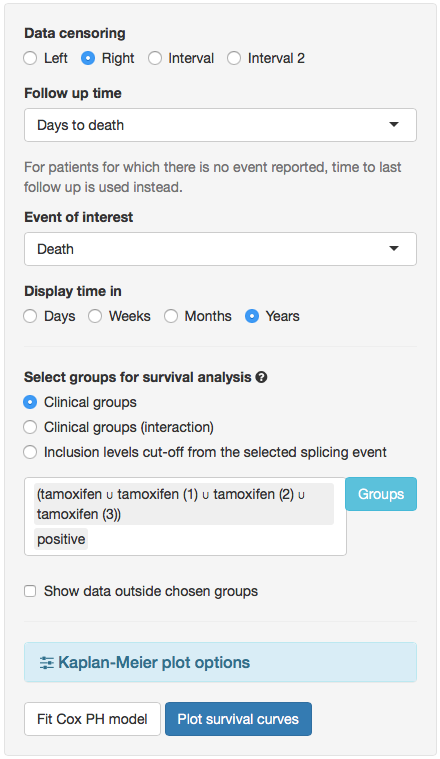

---

PSIchomics is an interactive R package for the analysis of alternative splicing
using data from
[The Cancer Genome Atlas (TCGA)](https://tcga-data.nci.nih.gov/docs/publications/tcga),
a repository of molecular data associated with 34 tumour types, including 
clinical information and transcriptomic data, such as the quantification of
RNA-Seq reads aligning to splice junctions (henceforth called junction
quantification) and exons.

# Installing and starting the program
Install PSIchomics by typing the following in an R console (the 
[R environment](https://www.r-project.org/) is required):

```{r, eval=FALSE}
## try http:// if https:// URLs are not supported
source("https://bioconductor.org/biocLite.R")
biocLite("psichomics")
```

After the installation, start the visual interface of the program in your 
default web browser by typing:

```{r, eval=FALSE}
library(psichomics)
psichomics()
```

# Downloading and loading TCGA data
The quantification of each alternative splicing event is based on the proportion
of junction reads that support the inclusion isoform, known as percent 
spliced-in or PSI [@wang2008].

To estimate this value for each splicing event, both alternative splicing
annotation and junction quantification are required. While alternative splicing
annotation is provided by the package, junction quantification may be retrieved
from TCGA.

1. To load TCGA data, click on the blue panel **Load TCGA/Firehose data**.
2. Fill in the **Tumour type** field with *Bladder Urothelial Carcinoma (BLCA)*.
3. Set the most recent date in the **Date** field.
4. In the **Data type** field, select *clinical* and *junction quantification*
(more data types will soon be supported).
5. Confirm if the **Folder to store data** field contains the folder where the 
files will be downloaded to.
6. Click **Load data**. If the required files are not available in the given 
folder, they will start downloading when you click **Download data** in the
message that appears. When all downloads have finished, proceed by clicking on
**Load data** again with the exact same parameters.

After the data finish loading (keep an eye on the progress at the top-right 
corner), the on-screen instructions will be replaced by the loaded datasets.
Please note the following: 

- To optimize performance, not all clincal data columns will be visible by 
default. However, columns of interest can be added or removed in the field 
**Visible columns**.
- Each column of a dataset is sortable by clicking on it to toggle between 
ascending and descending order and filtrable by clicking on and editing the 
field below the column name. Filtering and sorting of loaded data have **no** 
impact on the subsequent analyses available in the application.

```{r, echo=FALSE, fig.retina=NULL, out.width='400pt'}
knitr::include_graphics("load_data.png")
```

**Figure 1:** Available options for TCGA data loading.

# Quantifying alternative splicing
After loading the clinical and alternative splicing junction quantification data
from TCGA, quantify alternative splicing by clicking the blue panel **Quantify 
alternative splicing events** on the left.

1. Select the junction quantification dataset to use from the loaded data. For 
many tumour types, only one dataset is provided.
2. Designate the alternative splicing event annotation. Currently, only the
annotation for **Human (hg19/GRCh37 assembly)** is available[^3].
3. Choose the event type(s) of interest (for instance, **Skipped exon (SE)**).
4. Set the minimum read counts threshold to 10. Inclusion levels calculated with
total read counts below this threshold are discarded from further analyses.

[^3]: You can create additional alternative splicing annotations for PSIchomics
by parsing the annotation from programs like [VAST-TOOLS][4], [MISO][3],
[SUPPA][1] and [rMATS][2]. For more information, 
[read this tutorial](http://rpubs.com/nuno-agostinho/alt-splicing-annotation).

Click on **Quantify events** to start quantifying alternative splicing.

```{r, echo=FALSE, fig.retina=NULL, out.width='400pt'}
knitr::include_graphics("quantify_splicing.png")
```

**Figure 2:** Available options for splicing quantification.

# Survival analysis
To analyse survival data, click on the **Analyses** tab located in the 
navigation menu at the top and select **Survival analysis**.

Survival data can be analysed based on clinical attributes, for instance, by 
tumour stage and patient gender, using time to death as the follow-up time and
death as the event of interest. The default options cater for this common 
scenario. To create groups of patients based on clinical attributes (in this 
case, tumour stage and patient gender):

1. Click on the blue button **Groups**.
2. To create groups of patients based on tumour stage:
    1. Click on the field below **Select column**.
    2. Start typing `tumor_stage` and click the first relevant suggestion.
    3. Click on **Create group**. New groups have now been created based on the 
    unique values of that column (NA, stage i, stage ii, stage iii and stage 
    iv).
3. To create groups of patients based on gender:
    1. Click on the field below **Select column**.
    2. Start typing `gender` and click the first relevant suggestion.
    3. Click on **Create group**.
4. Close the group selection interface by hitting the **Close** button.
5. Plot survival curves and fit a Cox proportional hazards (PH) model by 
clicking on the respective buttons at the bottom.

The resulting plot will return the survival curves for patients grouped 
according to each distinct combination of their gender and tumour stage. If 
desired, the tumour stage can be analysed alone by clicking on the **Clinical 
groups to plot** and removing the patients' gender (see Figure 3). Information
regarding number of individuals and events is returned when hovering over each 
survival curve in the plot.

```{r, echo=FALSE, fig.retina=NULL, out.width='700pt'}

```

**Figure 3:** Analysing patient survival by tumour stage based on Bladder
Urothelial carcinoma clinical data.

# Principal component analysis (PCA)
To analyse principal components, click on the **Analyses** tab located in the 
navigation menu at the top and select **Principal component analysis (PCA)**.

Explore alternative splicing quantification groups using associated clinical
attributes:

1. Check **Center values**.
2. Uncheck **Scale values**[^1].
3. Set the tolerance of missing values[^2] to 0%.
4. Remove groups from **Filter data groups** to perform a PCA with all the data.
5. Click on **Calculate PCA**.

[^1]: As PSI values are fixed between an intervel of 0 to 1, there is no need to
scale values.
[^2]: Missing values are replaced with the median value for the respective 
event across samples.

After PCA is completed, its outcome can be plotted:

1. Choose **PC1** (principal component 1) as the X axis.
2. Choose **PC2** (principal component 2) as the Y axis.
3. Select groups of interest (for instance, the previously created tumour 
stages) to guide the colouring of points in the PCA plot.
4. Click on **Plot PCA**.

```{r, echo=FALSE, fig.retina=NULL, out.width='700pt'}
knitr::include_graphics("pca.png")
```

**Figure 4:** Available options for PCA performance and plotting.

Note that two PCA plots are rendered. The top plot shows the clinical samples 
(individuals), while the plot below displays the alternative splicing events
(loadings). The bubble size of the events represents the contribution of
a given variable to the selected principal component. Each splicing event is
clickable and it will show more information on that splicing event.

# Differential splicing analysis
To analyse differential splicing, click on the **Analyses** tab located in the
navigation menu at the top and select **Differential splicing analysis**.

1. Select the clinical groups on which to perform the analyses. For instance, 
splicing events can be analysed based on sample types (i.e., tumour versus 
normal tissue, if available) or clinical groups of the patients (e.g. stage of 
the disease). For now, select **Sample types**.
2. Confirm that all statistical analyses are checked.
3. Confirm p-values will be adjusted according to the **Benjamini-Hochberg's 
method**.
4. Click **Perform analyses**.

When the analyses are completed, the results are shown in a filtrable and 
sortable  table.

```{r, echo=FALSE, fig.retina=NULL, out.width='350pt'}
knitr::include_graphics("diff_splicing.png")
```

**Figure 5:** Options for differential splicing analysis.

## Statistical significance
Select statiscally significant splicing events by performing the following:

1. Find a column whose name includes *p-value* (**Horizontal scrolling** is 
required to visualise all available columns).
2. Click the box, labeled **All**, just below the column name to its contents to
values between 0 and around 0.05.
3. Repeat for at least one more column with name containing *p-value*.
4. Sort the values by the difference in variance by clicking on **Delta 
variance**.

## Survival analysis
To study the impact of an alternative splicing event on prognosis, survival data
can be incorporated. Kaplan-Meier curves can be plotted for groups of patients 
separated by the PSI that maximizes the significance of their difference in 
survival (i.e. minimizes the p-value of the Wald/Log/Logrank tests of difference
in survival between individuals with PSI below and above that threshold) for 
each of the 10 splicing events shown in the table at a time. 

After performing differential splicing analysis, the options shown in Figure 6
appear. Given that calculating the optimal splicing quantification cut-off can 
be a slow process, survival analysis is only performed for the events shown 
on-screen so the user must filter the events of interest beforehand.

To test differences in survival with another PSI cut-off, clicking on the 
plotted curves will lead the user back to the **Survival analyses** tab 
featuring a slider to select a new splicing quantification cut-off.

If an event is differentially spliced and it has an impact on patient
survivability, this particular association with the studied disease might be already described in the
literature (read more in section **Gene annotation**).

```{r, echo=FALSE, fig.retina=NULL, out.width='400pt'}
knitr::include_graphics("psi_cutoff.png")
```

**Figure 6:** Available options for survival analysis.

## Distribution of alternative splicing quantifications
The statistical analyses table provides a column with a density plot of the
distribution of the alternative splicing quantification for each event. By 
clicking on each plot (or its respective event identifier), a page dedicated to 
that alternative splicing event's statistics and exhibiting the density plot in 
greater detail will show up.

The distributions of different groups can be hereby compared more easily and 
more information about each group is accessible by hovering the respective curve
in the density plot. This plot also supports zooming by click-and-drag 
and omitting data series by clicking on the respective name in the legend.

# Gene annotation
To retrieve additional information about the gene, transcripts and proteins
related to an alternative splicing event, select the event from the control in 
the top right corner or go back to differential splicing analyses and click on
the event's identifier. Then, go to **Analyses** > **Gene, transcript and 
protein information** and examine the information regarding the selected event's 
gene and corresponding transcripts and proteins:

- The protein plot shows the UniProt matches for the selected transcript. Hover 
the protein's rendered domains to obtain more information on them. More
information about each protein can be retrieved by clicking the respective
**UniProt** link.
- Links to related research articles are also available. Click **Show more 
articles** to be directed to PubMed.
- Multiple links to related external databases, including the Human Protein 
Atlas, namely its Cancer Atlas showing antibody staining for diverse cancer
types, are available too.

# Feedback

All feedback on the program, documentation and associated material (including
this tutorial) is welcome. Please send any suggestions and comments to:

> Nuno Saraiva Agostinho (nunodanielagostinho@gmail.com)

> [Computation Biology, IMM](http://imm.medicina.ulisboa.pt/group/compbio/)

# References

[1]: https://bitbucket.org/regulatorygenomicsupf/suppa
[2]: http://rnaseq-mats.sourceforge.net
[3]: http://genes.mit.edu/burgelab/miso/
[4]: https://github.com/vastgroup/vast-tools