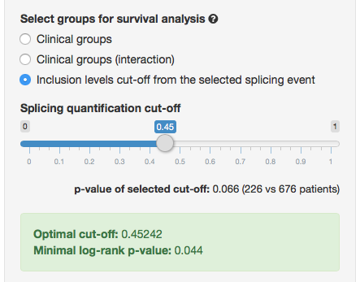

---

psichomics is an interactive R package for the analysis of alternative splicing
using data from [The Cancer Genome Atlas (TCGA)][5], a repository of molecular
data associated with 34 tumour types, including clinical information and
transcriptomic data, such as the quantification of RNA-Seq reads aligning to
splice junctions (henceforth called junction quantification) and exons.

# Installing and starting the program
Install psichomics by typing the following in an R console (the 
[R environment](https://www.r-project.org/) is required):

```{r, eval=FALSE}
## try http:// if https:// URLs are not supported
source("https://bioconductor.org/biocLite.R")
biocLite("psichomics")
```

After the installation, start the visual interface of the program in your 
default web browser by typing:

```{r, eval=FALSE}
library(psichomics)
psichomics()
```

# Downloading and loading TCGA data
The quantification of each alternative splicing event is based on the proportion
of junction reads that support the inclusion isoform, known as percent 
spliced-in or PSI [@wang2008].

To estimate this value for each splicing event, both alternative splicing
annotation and junction quantification are required. While alternative splicing
annotation is provided by the package, junction quantification may be retrieved
from TCGA. For instance, load breast cancer data by following these 
instructions:

1. To load TCGA data, click on the blue panel **Load TCGA/Firehose data**.
2. Fill in the **Tumour type** field with *Breast invasive carcinoma (BRCA)*.
3. Set the most recent date in the **Date** field.
4. In the **Data type** field, select *clinical* and *junction quantification*
(more data types will soon be supported).
5. Confirm if the **Folder to store the data** field contains the folder where
the files will be downloaded to.
6. Click **Load data**. If the required files are not available in the given 
folder, they will start downloading when you click **Download data** in the
message that appears. When all downloads have finished, proceed by clicking on
**Load data** again with the exact same parameters.

After the data finish loading (keep an eye on the progress at the top-right 
corner), the on-screen instructions at the right will be replaced by the loaded
datasets. Please note the following: 

- To optimise performance, not all clinical data columns will be visible by 
default. However, columns of interest can be added or removed in the field 
**Visible columns**.
- Each column of a dataset is sortable by clicking on it to toggle between 
ascending and descending order and filtrable by clicking on and editing the 
field below the column name. Filtering and sorting of loaded data have **no** 
impact on the subsequent analyses available in the application.

```{r, echo=FALSE, fig.retina=NULL, out.width='400pt'}
knitr::include_graphics("load_data.png")
```

**Figure 1:** Available options for TCGA data loading.

# Quantifying alternative splicing
After loading the clinical and alternative splicing junction quantification data
from TCGA, quantify alternative splicing by clicking the blue panel 
**Alternative splicing quantification** on the left.

1. Select the junction quantification dataset to use from the loaded data. For 
many tumour types, only one dataset is provided.
2. Designate the alternative splicing event annotation. Currently, only the
annotation for **Human (hg19/GRCh37 assembly)** is available[^1].
3. Choose the event type(s) of interest. To follow the rest of this tutorial,
only select **Skipped exon (SE)**.
4. Set the minimum read counts threshold to 10. Inclusion levels calculated with
total read counts below this threshold are discarded from further analyses.

[^1]: You can create additional alternative splicing annotations for psichomics
by parsing the annotation from programs like [VAST-TOOLS][4], [MISO][3],
[SUPPA][1] and [rMATS][2]. For more information, [read this tutorial][6].

Click on **Quantify events** to start quantifying alternative splicing.

```{r, echo=FALSE, fig.retina=NULL, out.width='400pt'}
knitr::include_graphics("quantify_splicing.png")
```

**Figure 2:** Available options for alternative splicing quantification.

# Survival analysis

Survival data can be analysed based on clinical attributes, for instance, by 
tumour stage and patient gender, using time to death as the follow-up time and
death as the event of interest. To analyse survival data, click on the 
**Analyses** tab located in the navigation menu at the top and select 
**Survival analysis**.

Around 80% of breast cancers have cells that express estrogen receptors (ER) and 
require estrogen binding to grow. Estrogen receptors may be blocked by tamoxifen
and other drugs. These drugs are thus used as treatment or prevention for
ER-positive breast cancers.

To compare the overall survival of ER-positive patients treated with and without
tamoxifen:

1. Check **right** data censoring.
2. Use *days to death* for the **follow up time**.
3. Use *death* as the **event of interest**.
4. Display time in **years**.
5. Click on the blue button **Groups**.
6. To create groups of patients based on ER expression:
    1. Select to subset by **Column**.
    2. Click on the field below **Select column**.
    3. Start typing `estrogen_receptor` and click the first suggestion.
    4. Click on **Create group**. New groups have now been created based on the 
    unique values of that column (*NA*, *indeterminate*, *negative* and
    *positive*).
    5. Click on the *indeterminate* and *NA* groups and click on **Remove** as
    these groups will not be needed for this tutorial.
7. To create groups of patients treated with tamoxifen:
    1. Select to subset by **Regular expression**.
    2. In **Regular expression**, type *tamoxi.\*en* (to retrieve records with
    either *tamoxifen* or *tamoxiphen*).
    3. Name the group as *tamoxifen*.
    4. Click on the field below **Select column to GREP**, type *drug_name* and
    select the first suggestion.
    5. Click on **Create group**.
    6. Go back to step 7.4 and create groups with the second, the third and the
    fourth suggestion[^4].
    7. Select all the *tamoxifen* groups by clicking on them one by one and 
    click on **Merge**.
    8. Close the group selection interface by clicking on the **Close** button.
8. In the group selection field, select the merged group and the *positive*
group for ER expression.
9. Plot survival curves and fit a Cox proportional hazards (PH) model by 
clicking on the respective buttons at the bottom.

[^4]: Unfortunately, TCGA data divides drugs taken by patients through multiple
columns. Here, only the majority of tamoxifen-treated patients are selected.

The resulting plot will return the survival curves for:

* ER-positive tamoxifen-treated patients,
* ER-positive non-tamoxifen-treated patients and
* non-ER-positive tamoxifen-treated patients.

Information regarding number of individuals and events is returned when hovering
over each survival curve in the plot. The plot also allows zooming in by
clicking and dragging and to omit data series by clicking on their name in the 
legend.

```{r, echo=FALSE, fig.retina=NULL, out.width='400pt'}
knitr::include_graphics("survival.png")
```

**Figure 3:** Available options for patient survival.

# Exploring principal component analysis

Principal component analysis (PCA) is a technique to reduce data dimensionality
by identifying variable combinations (called principal components) that explain
the variance in the data [@Ringner2008gb]. To analyse principal components, 
click on the **Analyses** tab located in the navigation menu at the top and
select **Principal component analysis (PCA)**.

Explore alternative splicing quantification groups by estrogen receptor (ER)
expression:

1. Confirm that **Inclusion levels** will be used as the input of the PCA.
2. In data preprocessing, check **Center values** and uncheck 
**Scale values**[^2].
4. Set the tolerance of missing values[^3] to 0%.
5. Click on the blue **Groups** button:
6. To create groups of patients based on ER expression:
    1. Click on the field below **Select column**.
    2. Start typing `estrogen_receptor` and click the first suggestion.
    3. Click on **Create group**. New groups have now been created based on the 
    unique values of that column (*NA*, *indeterminate*, *negative* and
    *positive*).
    4. Click on the *indeterminate* and *NA* groups and click on **Remove** as
    these groups will not be needed for this tutorial.
    5. Click **Close**.
7. Confirm that **Filter data groups** contains the groups **positive** and
**negative**.
5. Click on **Calculate PCA**.

[^2]: As PSI values are fixed between an interval of 0 to 1, there is no need to
scale values.
[^3]: Missing values are replaced with the median value for the respective 
event across samples.

After PCA is performed, options to plot the PCA result appear. Note that the
explained variance of each principal component is shown next to the respective
component. The **variance plot** is also available to compare the explained
variance across principal components.

1. Choose **PC1** (principal component 1) as the X axis.
2. Choose **PC2** (principal component 2) as the Y axis.
3. Select groups of interest (for instance, the previously created groups) to 
guide the colouring of points in the PCA plot.
4. Click on **Plot PCA**.

```{r, echo=FALSE, fig.retina=NULL, out.width='700pt'}
knitr::include_graphics("pca.png")
```

**Figure 4:** Available options for PCA performance and plotting.

Two PCA plots are then rendered. The plot above is a **score plot** that shows
the clinical samples, while the **loadings plot** below displays the variables 
(in this case, alternative splicing events). The bubble size of the loadings 
plot represent the total contribution of each alternative splicing event to the
selected principal components. By clicking in one alternative splicing event, 
the respective differential splicing analysis will be shown.

Note that the clinical samples from ER-positive individuals (i.e. patients whose
cancer cells express estrogen receptors) seem to separate from samples from
ER-negative individuals along the principal component 1. There is one 
alternative splicing event that may contribute to this separation:
*SE 10 + 79797062 79799962 79799983 79800373 RPS24*. Click on this alternative 
splicing event to perform differential splicing analysis.

## Differential splicing analysis

By default, differential splicing analysis is performed by sample types (i.e.
tumour, normal, metastasis, etc) for multiple parametric and non-parametric
statistical tests.

* Hover each group in the plot to compare the respective number of samples,
median and variance.
* To zoom in a specific region, click-and-drag in the region of interest.
* To hide or show groups, click on their name in the legend.

Not all statistical tests are available depending on the number of groups
available. To edit the groups, click in the group names on the left (under 
**Clinical groups on which to perform the analyses**). In here, uncheck 
*Metastasis* and click *Single event* above the grey box to go back. The 
statistical tests presented are now only performed using the samples that match
the other two groups. Check if any tests show statistical significance (for
instance, Log-rank p-values below 0.05).

Now, try to change the groups to *positive* and *negative* for ER expression and
check if any of the tests show statistical significance.

To study survival analysis by splicing quantification cut-off, click on the
blue **Take me there** button at the bottom of the grey box.

## Survival analysis

To study the impact of an alternative splicing event on prognosis, Kaplan-Meier
curves may be plotted for groups of patients separated by a given PSI cut-off 
for the selected alternative splicing event.

The optimal PSI cut-off that maximises the significance of their difference in
survival (i.e. minimises the p-value of the Wald/Log/Logrank tests of difference
in survival between individuals with PSI below and above that threshold) is
suggested in the green box and used as the default PSI cut-off, when available.
This value can be manually adjusted using the slider named **Splicing 
quantification cut-off**.

Click the buttons *Plot survival curves* and/or *Fit Cox PH model* whenever this
slider is changed to update the Kaplan-Meier plot and/or the Cox model.

```{r, echo=FALSE, fig.retina=NULL, out.width='350pt'}

```

**Figure 5:** Options to adjust the alternative splicing quantification cut-off
when performing survival analysis.

## Literature support and external database information

If an event is differentially spliced and has an impact on patient survival, 
its association with the studied disease might be already described in the
literature. To check so, go to **Analyses** >
**Gene, transcript and protein information** where information regarding the
associated gene (such as description and genomic position), transcripts and
protein domain annotation are available.

- The protein plot shows the UniProt matches for the selected transcript. Hover 
the protein's rendered domains to obtain more information on them. More
information about each protein can be retrieved by clicking the respective
**UniProt** link.
- Links to related research articles are also available. Click **Show more 
articles** to be directed to PubMed.
- Multiple links to related external databases are available too:
    - **Human Protein Atlas (Cancer Atlas)** allows to check the evidence of a
    gene at protein level for multiple cancer tissues.
    - **VastDB** shows multi-species alternative splicing profiles for diverse 
    tissues and cell types.
    - **UCSC Genome Browser** may reveal protein domain disruptions caused by 
    the alternative splicing event. To check so, activate the **Pfam in UCSC
    Gene** and **UniProt** tracks (in *Genes and Gene Predictions*) and check if
    any domains are annotated in the alternative and/or constitutive exons of 
    the splicing event.

# Exploring differential splicing analysis

To analyse differential splicing, click on the **Analyses** tab located in the
navigation menu at the top and select **Differential splicing analysis**.

1. Select the clinical groups on which to perform the analyses. For instance, 
splicing events can be analysed based on sample types (i.e., tumour versus 
normal tissue, if available) or clinical groups of the patients (e.g. stage of 
the disease). Select **Patient's clinical groups** and input the *positive* and
*negative* ER-expression groups.
2. Confirm that all statistical analyses are checked.
3. Confirm p-values will be adjusted according to the **Benjamini-Hochberg's 
method**.
4. Click **Perform analyses**.

When the analyses are completed, the results are shown in a filtrable and 
sortable  table.

```{r, echo=FALSE, fig.retina=NULL, out.width='350pt'}
knitr::include_graphics("diff_splicing.png")
```

**Figure 6:** Options for differential splicing analysis.

## Statistical significance
Select statistically significant splicing events by performing the following:

1. Find a column whose name is *Fligner-Killeen p-value (BH adjusted)*
(**Horizontal scrolling** is required to visualise all available columns).
2. Click the box, labeled **All**, just below the column name to its contents to
values between 0 and around 0.05.
3. Sort the values by the difference in variance by clicking once on **Delta
variance**.

## Distribution of alternative splicing quantifications

The statistical analyses table provides a column with a density plot of the
distribution of the alternative splicing quantification for each event. By 
clicking on the plot (or its respective event identifier), a page dedicated to 
that alternative splicing event's statistics and exhibiting the density plot in 
greater detail will show up.

To go back to the table with all events, click in the button above the grey box
titled **All events (table)**.

## Survival analysis

To study the impact of an alternative splicing event on prognosis, survival data
can be incorporated for 10 splicing events shown in the table at a time, by
default. After performing differential splicing analysis, the options shown in 
**Figure 7** appear. Given the slow process of calculating the optimal splicing
quantification cut-off for multiple events, it is recommended to perform this on
either the events shown on-screen or after filtering the table for 
differentially spliced events supported by statistical significance.

Perform survival analysis by alternative splicing quantification cut-off:

1. Check **right** data censoring.
2. Use *days to death* for the **follow up time**.
3. Use *death* as the **event of interest**.
4. Select to perform survival analyses based on the **splicing events shown in
the screen**.
5. Click on **Plot survival curves**.

```{r, echo=FALSE, fig.retina=NULL, out.width='400pt'}
knitr::include_graphics("psi_cutoff.png")
```

**Figure 7:** Available options for survival analysis.

Kaplan-Meier plots with the results will appear below the table. Each plot
corresponds to one alternative splicing event shown in the table above. To test
differences in survival with another PSI cut-off, clicking on the plotted curves
will lead the user to the **Survival analyses** tab, allowing to manually adjust
the alternative splicing quantification cut-off.

Click on one alternative splicing event with a p-value below 0.05 (such as the
splicing events for *C1D* or *ALG13*). Check literature information and search
external databases for more information, including on **UCSC Genome Browser** 
for putative protein domain disruptions resulting from the alternative splicing
event.

# Exploring an alternative splicing event of interest

At any time during these analyses, the alternative splicing event of interest
may be changed by clicking in **Change...** in the top-right corner relative to
the selected alternative splicing event. Any analyses that depend on the 
selected alternative splicing event are now performed based on the currently
selected event.

This allows the user to explore an alternative splicing event of their choice.
For instance, the event *SE 6 - 46823711 46822518 46822452 46821808 GPR116*
has been previously reported to have potential prognostic value in breast
cancer patients, where patients with higher PSI values for this event have a 
lower 5-year survival rate than patients with lower PSI values [@Tsai2015jf].

Confirm so by performing differential splicing (for example, normal vs tumour
samples) on this event and survival analysis by PSI cut-off. Also, check
literature information and search external databases for more information,
including on **UCSC Genome Browser** for putative protein domain disruptions
resulting from the alternative splicing event.

# Feedback

All feedback on the program, documentation and associated material (including
this tutorial) is welcome. Please send any suggestions and comments to:

> Nuno Saraiva Agostinho (nunodanielagostinho@gmail.com)

> [Computation Biology Lab, Instituto de Medicina Molecular (Portugal)][7]

# References

[1]: https://bitbucket.org/regulatorygenomicsupf/suppa
[2]: http://rnaseq-mats.sourceforge.net
[3]: http://genes.mit.edu/burgelab/miso/
[4]: https://github.com/vastgroup/vast-tools
[5]: https://tcga-data.nci.nih.gov/docs/publications/tcga
[6]: http://rpubs.com/nuno-agostinho/alt-splicing-annotation
[7]: http://imm.medicina.ulisboa.pt/group/compbio