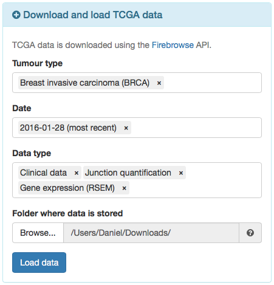

---

*psichomics* is an interactive R package for integrative analyses of alternative
splicing and gene expression based on [The Cancer Genome Atlas (TCGA)][TCGA]
(containing molecular data associated with 34 tumour types), the
[Genotype-Tissue Expression (GTEx)][GTEx] project (containing data for multiple
normal human tissues), [Sequence Read Archive][SRA] and user-provided data. The 
data from GTEx, TCGA and select SRA projects include subject/sample-associated
information and transcriptomic data, such as the quantification of RNA-Seq reads
aligning to splice junctions (henceforth called junction quantification) and 
exons.

# Installing and starting the program
Install *psichomics* by typing the following in an R console (the 
[R environment](https://www.r-project.org/) is required):

```{r install, eval=FALSE}
install.packages("BiocManager")
BiocManager::install("psichomics")
```

After the installation, start the visual interface of the program in your 
default web browser by typing:

```{r, eval=FALSE}
library(psichomics)
psichomics()
```

# Exploration of clinically-relevant, differentially spliced events in breast cancer

> The following case study was adapted from *psichomics*' original article:
>
> Nuno Saraiva-Agostinho and Nuno L. Barbosa-Morais (2019). 
**[psichomics: graphical application for alternative splicing quantification and analysis][article]**. *Nucleic Acids Research*.

Breast cancer is the cancer type with the highest incidence and mortality in 
women [@Torre2015] and multiple studies have suggested that transcriptome-wide
analyses of alternative splicing changes in breast tumours are able to uncover
tumour-specific biomarkers [@Tsai2015; @DananGotthold2015; @Anczukow2015].
Given the relevance of early detection of breast cancer to patient survival, we 
can use *psichomics* to identify novel tumour stage-I-specific molecular 
signatures based on differentially spliced events.

## Downloading and loading TCGA data
The quantification of each alternative splicing event is based on the proportion
of junction reads that support the inclusion isoform, known as percent 
spliced-in or PSI [@wang2008].

To estimate this value for each splicing event, both alternative splicing
annotation and junction quantification are required. While alternative splicing
annotation is provided by the package, junction quantification may be retrieved
from multiple sources.

Start by loading breast cancer data by following these instructions:

1. To load TCGA data, click on the blue panel **Download/load TCGA data**.
2. Fill in the **Tumour type** field with *Breast invasive carcinoma (BRCA)*.
3. Set the most recent date available in the **Date** field.
4. In the **Data type** field, select *Clinical data*, 
*Junction quantification* and *Gene expression (RSEM)*.

> Note there is also the option for *Gene expression (normalised by RSEM)*.
However, we recommend to load the raw gene expression data instead, followed by 
filtering and normalisation as demonstrated afterwards.

5. Confirm if the **Folder where data is stored** field indicates the 
appropriate folder to where your browser downloads files.
6. Click **Load data**. If the required files are not available in the given 
folder, an information message will appear asking if you want to download the
requested data. Click **Download data** and, when all downloads are finished,
load data by clicking on **Load data** again (do not change any parameters).

> **Downloading multiple files:** Note that multiple files will be requested for 
download at once. Some web browsers (such as Google Chrome) will ask for your
confirmation before allowing such behaviour. In order to proceed, please allow
multiple downloads.

> **Windows limitations**: If you are using *Windows*, note that the downloaded 
files have huge names that may be over [*Windows* Maximum Path Length][maxpath].
A workaround would be to manually rename the downloaded files to have shorter 
names, move all downloaded files to a single folder and load such folder by
going to **Load user files** > **Folder input** and selecting the newly-created 
folder in **Folder where data is stored**.

```{r, echo=FALSE, fig.retina=NULL, out.width='400pt', fig.cap="Options to load TCGA data."}

```

After the data finish loading (keep an eye on the progress bar at the top-right 
corner), the on-screen instructions at the right will be replaced by the loaded
data, including options to view and save such data.

## Filtering and normalising gene expression
To filter and normalise gene expression, click the green panel 
**Gene expression filtering and normalisation**. Within this panel, click the 
different grey sections (*Gene filtering*, *Normalisation* and 
*Compute CPM and log-transform*) to check the settings available for processing
gene expression. When you are ready to proceed, click 
**Filter and normalise gene expression**.

```{r, echo=FALSE, fig.retina=NULL, out.width='400pt', fig.cap="Options to filter and normalise gene expression."}

```

## Quantifying alternative splicing
After loading the clinical and alternative splicing junction quantification data
from TCGA, quantify alternative splicing by clicking the green panel 
**Alternative splicing quantification**.

1. From the loaded data, select the junction quantification dataset to use in 
**Alternative splicing junction quantification**. For many tumour types, only 
one dataset is provided.
2. Select the alternative splicing event annotation 
**Human hg19/GRCh37 (2017-10-20)**. Note that there are other annotation files
available and you can also load custom annotation files.

> **Custom splicing annotation:** Additional alternative splicing annotations 
can be prepared for *psichomics* by parsing the annotation from programs like 
[VAST-TOOLS][VAST-TOOLS], [MISO][MISO], [SUPPA][SUPPA] and [rMATS][rMATS]. Note 
that SUPPA and rMATS are able to create their splicing annotation based on
transcript annotation. For more information, 
[read this tutorial][annotation-tutorial].

3. Choose the event type(s) of interest. For the purposes of following the case
study, select **Skipped exon (SE)**, **Mutually exclusive exon (MXE)**,
**Alternative 5' splice site (A5SS)**, **Alternative 3' splice site (A3SS)**,
**Alternative first exon (AFE)** and **Alternative last exon (ALE)**.
4. Set the minimum read counts' threshold to 10. Inclusion levels calculated 
with total read counts below this threshold are discarded from further analyses.
5. Click **Quantify alternative splicing**.

```{r, echo=FALSE, fig.retina=NULL, out.width='400pt', fig.cap="Options to quantify alternative splicing."}

```

## Data grouping
In order to group data for downstream analyses, look for the navigation bar on 
the top and click **Groups**. In the displayed table, confirm that three groups
are automatically present based on the available sample types: *Metastatic*,
*Primary solid Tumor* and *Solid Tissue Normal*.

Next, to create groups by tumour stage, click in the field **Select attribute**
and type *tumor stage*. Select the first hit (it should be 
*patient.stage_event.pathologic_stage_tumor_stage*) and click **Create group**.

```{r, echo=FALSE, fig.retina=NULL, out.width='400pt', fig.cap="Creating groups by tumour stage."}

```

The table on the right will be updated with the created groups per tumour stage.
Next, we will merge tumour stages so as to have only Stage I, II, III and IV. 
To do so:

1. Select *stage i*, *stage ia* and *stage ib* in the table.

> **Hint:** You can shift-click to select multiple groups at once.

2. Click **Merge** in the toolbar below the table. A new group named
*(stage i ∪ stage ia ∪ stage ib)* will appear.
3. Select the newly created and the *Primary solid Tumor* groups and click 
**Intersect** to retrieve Tumour Stage I samples.
4. Optionally, rename the newly created group 
*((stage i ∪ stage ia ∪ stage ib) ∩ Primary solid Tumor)* by selecting it and
clicking in **Rename selected group** on the bottom. Type *Tumour Stage I* and
click **Rename**.

Do the same for tumour stages II, III and IV with their respective subgroups 
(ignore stage X samples as they are uncharacterised tumour samples). We also
recommend to remove groups that are of no interest by selecting them and 
clicking **Remove**. In the end, you should end up with a table similar to the 
one below.

> **Changing group colours**: The colours defined for each group will be used 
to represent those same groups in the plots throughout *psichomics*. To change
the colour of a given group, select that group and, next to the rename field, 
change its associated colour (by clicking on the colour field and picking a new
colour or by inputting a HEX code) and click **Set colour**.

```{r, echo=FALSE, fig.retina=NULL, out.width='600pt', fig.cap="Table showing data groups as created for downstream analyses."}

```

The created groups can then be saved in a text file and loaded in a future 
session. To do so, in the toolbar below the table click the folder icon (right 
next to **More**) and select **Save elements from all groups**.

```{r, echo=FALSE, fig.retina=NULL, out.width='400pt', fig.cap="Options to save and load groups."}

```

## Principal component analysis (PCA)
PCA is a technique to reduce data dimensionality by identifying variable 
combinations (called principal components) that explain the variance in the data
[@Ringner2008]. To analyse principal components, click on the **Analyses** tab
located in the navigation menu at the top and select 
**Principal component analysis (PCA)**.

### PCA performance
To perform PCA on alternative splicing data using all samples:

1. In **Data to perform PCA on**, select **Inclusion levels**.
2. Select **Center values** and de-select **Scale values**.
3. Perform PCA on **All samples**.
4. **Number of missing values to tolerate per event**: select 5% of the samples
(i.e. 61 samples).

> As PCA cannot be performed on data with missing values, missing values need to
be either removed (thus discarding data from whole splicing events or genes) or 
imputed (i.e. attributing to missing values the median of the non-missing ones).
This input allows to select the number of missing values that are tolerable per 
event (i.e. if a splicing event or gene has less than N missing values, those 
missing values will be imputed; otherwise, the event is discarded from PCA).

5. Perform PCA on *All genes and splicing events*.
6. Click **Calculate PCA**.

### PCA plotting
After PCA is performed, the *Plot PCA* panel will automatically open. Note that
the explained variance of each principal component (PC) is shown next to the 
respective component and that PC1 explains most of the data variance, followed 
by PC2, then PC3, then PC4, etc. The **variance plot** is also available to 
compare the explained variance across principal components (by clicking 
**Show variance plot**). Now:

1. Select PC1 as the X axis.
2. Select PC2 as the Y axis.
3. In **Sample colouring**, select **Colour using selected groups** and in the
group selection input insert *Tumour Stage I*, *Tumour Stage II*, 
*Tumour Stage III*, *Tumour Stage IV* and *Solid Tissue Normal*.
4. In **Variables to plot in loadings plot**, select **All variables**.

> For performance reasons, only the **Top 100** variables that most contribute
to the select principal components are plotted by default.

5. Click **Plot PCA**.

```{r, echo=FALSE, fig.retina=NULL, out.width='800pt', fig.cap="Options to perform and visualise PCA."}

```

Two PCA plots are then rendered. The plot above is a **score plot** that shows
the clinical samples, while the **loadings plot** below displays the variables 
(in this case, alternative splicing events). The table below the loadings plot
depicts the contribution of each variable to each PC.

> **Hint:** As most plots in *psichomics*, PCA plots can be zoomed-in by
clicking-and-dragging within the plot (click *Reset zoom* to zoom-out). To 
toggle the visibility of the data series represented in the plot, click its 
respective name in the plot legend.

```{r, echo=FALSE, fig.retina=NULL, out.width='400pt', fig.cap="PCA score and loading plots"}

```

To perform PCA on alternative splicing data using only Tumour Stage I and Normal
samples, click on the blue **Perform PCA** panel and select to 
**Perform PCA on... Samples from selected groups**. In the field that appears,
select *Tumour Stage 1* and *Solid Tissue Normal*. Afterwards, click 
**Perform PCA** and follow the same steps as before to plot it.

Now, click on one of the events that most contribute to the separation between 
tumour stage I and normal samples (one of the events with extreme values for the
PC1; i.e. the X axis). Differential splicing analysis for that splicing event 
across selected groups are shown.

To perform PCA using gene expression (both using all samples and only Tumour
Stage I and Normal samples), go back to principal component analysis, click in 
the **Perform PCA** panel, change **Data to perform PCA on** to
*Gene expression (normalised)* and follow previous instructions.

## *NUMB* exon 12 inclusion and correlation with QKI gene expression
One of the splicing events that most contribute the separation between tumour 
stage I and normal samples is **NUMB exon 12 inclusion**, whose protein is 
crucial for cell differentiation as a key regulator of the Notch pathway. The
RNA-binding protein QKI has been shown to repress NUMB exon 12 inclusion in
lung cancer cells by competing with core splicing factor SF1 for binding to the
branch-point sequence, thereby repressing the Notch signalling pathway, which 
results in decreased cancer cell proliferation [@zong2014].

The identifier for *NUMB* exon 12 inclusion in *psichomics* is 
**SE 14 - 73749067 73746132 73745989 73744001 NUMB**. On the top right corner,
the selected alternative splicing event can be altered by clicking 
**Change...**. Click **Change...** and input the given identifier.

### Differential inclusion of *NUMB* exon 12
In order to check whether a significant difference in *NUMB* exon 12 inclusion
between tumour and normal TCGA breast samples. To do so, go to **Analyses** > 
**Individual alternative splicing event** and click 
**Samples by selected groups**. In the group input element, insert the groups 
*Solid Tissue Normal* and *Primary solid Tumor*. Finally, click 
**Perform analyses**. 

Consistent with the cited article, *NUMB* exon 12 inclusion is significantly
increased in cancer.

Also of interest:

* Hover each group in the plot to compare the respective number of samples,
median and variance.
* To zoom in a specific region, click-and-drag in the region of interest.
* To hide or show groups, click on their name in the legend.

```{r, echo=FALSE, fig.retina=NULL, out.width='400pt', fig.cap="Differential splicing of *NUMB* exon 12 between tumour and normal samples."}

```

### Correlation between *NUMB* exon 12 inclusion and QKI expression
To check if *NUMB* exon 12 inclusion is correlated with QKI expression, go to
**Analyses** > **Correlation of gene expression and alternative splicing** and
perform the following:

1. In **Gene expression**, select **Gene expression (normalised)**.
2. In **Gene**, type *QKI* and select the first hit (it may take two seconds for
a hit to appear).
3. In **Alternative splicing events**, remove any alternative splicing events in
there, input **SE 14 - 73749067 73746132 73745989 73744001 NUMB** and select
the first hit.
4. Perform correlation analysis on **All samples**.
5. Correlation method should be set to **Spearman's rank correlation rho**.
6. Set the alternative hypothesis to **Two-sided**.
7. Finally, leave remaining options as default and click **Correlate**.

According to the obtained results and also consistent with the previous article,
the inclusion of the exon is negatively correlated with QKI expression.

```{r, echo=FALSE, fig.retina=NULL, out.width='400pt', fig.cap="Correlation between *NUMB* exon 12 inclusion and QKI expression in all TCGA breast samples."}

```

## Differential splicing analysis

To analyse differential splicing, click on the **Analyses** tab located in the
navigation menu at the top and select 
**Exploratory (multiple splicing events)**. Next:

1. Click on the blue panel **Perform statistical analyses** to open it.
2. In **Groups of samples to analyse**, click on **Samples by selected groups**.
3. Select the *Tumour Stage I* and *Solid Tissue Normal* groups.
4. In **Splicing events to analyse**, select **All splicing events**.
5. Confirm that all statistical analyses are checked.
6. Confirm p-values will be adjusted according to the
**Benjamini-Hochberg's method**.
7. Click **Perform analyses**.

When the analyses complete, the results are shown in a plot and in a filterable
and sortable table.

### Filtering alternative splicing events
Filter events in both the plot and the table by a considerable difference in
median between the selected groups (|Δ Median PSI| > 0.1):

1. Click on the blue panel **Plot options and table filtering** to open it.
2. Click on the **X axis** tab.
3. Check if *Δ Median* is selected for the X axis.
4. Click on **Highlight points based on Y values** and select values lower than
-0.1 and higher than 0.1. To do so, input -0.1 in the **Lower limit**, 0.1 in 
the **Upper limit** and check **Invert highlighted values**.

Next, filter statistically significant splicing events
(Wilcoxon q-value ≤ 0.01):

1. Click on the **Y axis** tab.
2. Select *Wilcoxon p-value (BH adjusted)* for the Y axis.
3. In **Data transformation of Y values**, select *-log10(|y|)*.
4. Click on **Highlight points based on Y values** and change the minimum value
to filter significant events. For instance, to consider a p-value of 0.01 or
lower, the lower limit should be -log10(0.01), i.e. 2.

```{r, echo=FALSE, fig.retina=NULL, out.width='800pt', fig.cap="Differentially spliced events (|Δ Median PSI| > 0.1 and Wilcoxon q-value ≤ 0.01). Labelled splicing events have putative prognostic value (more on that in the following section)."}

```

The table below is filtered according to highlighted events shown in the plot. 
If you zoom in the plot (by clicking and dragging), the table will be filtered
according to the highlighted events in the zoomed area only (reset zoom to show
all highlighted events again). If no events are highlighted, the table presents
all events currently shown in the plot.

The table itself is also filterable and sortable. For instance, to sort the 
table by the difference in variance, click once on **Δ Variance**. Note that
**horizontal scrolling** is required to visualise all available columns.

The table also provides a column with a density plot of the distribution of the
alternative splicing quantification for each event. By clicking on the density
plot (or its respective event identifier), a page dedicated to that alternative
splicing event's statistics and exhibiting the density plot in greater detail 
will show up.

### Performing multiple survival analysis

To study the impact of alternative splicing events on prognosis, Kaplan-Meier
curves may be plotted for groups of patients separated by the optimal PSI 
cutoff for a given alternative splicing event that maximises the significance of
group differences in survival analysis (i.e. minimises the p-value of the 
log-rank tests of difference in survival between individuals whose samples have
their PSI below and above that threshold).

Given the slow process of calculating the optimal splicing quantification 
cutoff for multiple events, it is recommended to perform this after filtering 
the table for differentially spliced events supported by statistical 
significance.

1. Click on the blue panel
**Survival analyses by splicing quantification cutoff** to open it.
2. Check **right** data censoring.
3. Use *days to death* for the **follow up time**.
4. Use *death* as the **event of interest**.
5. In **Sample filtering**, select *Primary solid Tumour* (i.e. only use values
from tumour samples to perform survival analyses).
6. Select to perform survival analyses based on the 
**Splicing events in current page of the table**.
7. Click on **Plot survival curves**.

Kaplan-Meier plots will appear in the table. Click on the plotted curves to 
automatically go to the **Survival analyses** tab, where you can manually adjust
the alternative splicing quantification cutoff.

## Differential gene expression

Detected alterations in alternative splicing may simply be a reflection of 
changes in gene expression levels. Therefore, to disentangle these two effects, 
differential expression analysis between tumour stage I and normal samples 
should also be performed. To do so, click on the **Analyses** tab located in the
navigation menu at the top and select 
**Exploratory (multiple genes)**. Next:

1. Click on the blue panel **Perform differential expression analyses** to open 
it.
2. In **Gene expression dataset**, select **Gene expression (normalised)**.
3. Within the **Gene-wise linear model fit** panel, select the groups 
*Tumour Stage I* and *Solid Tissue Normal* for differential expression.
4. Open the **Differential expression statistics** panel and check the default
settings.
5. Confirm p-values will be adjusted according to the
**Benjamini-Hochberg's method**.
6. Click **Perform analyses**.

You can further filter the analyses as previously mentioned for differential
splicing analyses.

```{r, echo=FALSE, fig.retina=NULL, out.width='800pt', fig.cap="Differentially expressed genes (|log2(Fold-change)| > 1 and FDR ≤ 0.01). Labelled genes are those with alternative splicing events with putative prognostic value."}

```

### *UHRF2* exon 10 inclusion

One splicing event with prognostic value is the alternative splicing of *UHRF2* 
exon 10. Cell-cycle regulator UHRF2 promotes cell proliferation and inhibits the
expression of tumour suppressors in breast cancer [@wu2012].

The identifier for *UHRF2* exon 10 inclusion in *psichomics* is 
**SE 9 + 6486925 6492303 6492401 6493826 UHRF2**. On the top right corner, the
selected alternative splicing event can be altered by clicking *Change...*.
Click *Change...* and input the given identifier.

#### Differential splicing analysis

In order to test for a significant difference in *UHRF2* exon 10 inclusion
between tumour stage I and normal samples, go to **Analyses** > 
**Individual alternative splicing event** and click 
**Samples by selected groups**. In the group input element, insert the groups
*Solid Tissue Normal* and *Primary solid Tumor*. Finally, click 
**Perform analyses**.

Higher inclusion of *UHRF2* exon 10 is associated with normal samples.

```{r, echo=FALSE, fig.retina=NULL, out.width='400pt', fig.cap="Differential splicing of *UHRF2* exon 10 between tumour stage I and normal samples."}
knitr::include_graphics("img/UHRF2_exon_10_inclusion_differential_splicing.png")
``` 

#### Survival analysis 

To study the impact of alternative splicing events on prognosis, Kaplan-Meier
curves may be plotted for groups of patients separated by a given PSI 
cutoff for a given alternative splicing event. The optimal PSI cutoff 
maximises the  significance of group differences in survival analysis (i.e. 
minimises the p-value of the log-rank tests of difference in survival between
individuals whose samples have a PSI below and above that threshold).

To perform survival analysis on a specific event, go to **Analyses** > 
**Survival analysis**.

1. Check **right** data censoring.
2. Use *days to death* for the **follow up time**.
3. Use *death* as the **event of interest**.
4. Display time in **years**.
5. To create groups of patients based on an inclusion levels cutoff, select
**Inclusion levels cutoff from the selected splicing event**. 
6. In **Sample filtering**, select *Primary solid Tumor* to perform survival 
analysis using values solely from tumour samples.
7. In the **Splicing quantification cutoff**, check the value is automatically
set to 0.09 (the optimal cutoff).
8. In the **Kaplan-Meier plot options**, de-select 
**Show censored observations** to more clearly display the survival plots.
8. Plot survival curves and fit a Cox proportional hazards (PH) model by 
clicking on the respective buttons at the bottom.

As per the results, higher inclusion of *UHRF2* exon 10 (PSI ≥ 0.09) is 
associated with better prognosis.

```{r, echo=FALSE, fig.retina=NULL, out.width='400pt', fig.cap="Prognostic value of *UHRF2* exon 10 inclusion (patients separated by the optimal PSI cutoff of 0.09)."}

``` 

#### Differential expression
To check whether alternative splicing changes are related with gene expression 
alterations, let us perform differential expression analysis on UHRF2. Go to
**Analyses** > **Individual gene**.

1. Select *Gene expression (normalised)* for the *Gene expression* field.
2. In **Gene**, type *UHRF2* and select the first hit.
3. In **Groups of samples to compare**, select **Samples by selected groups**.
4. Insert the groups *Tumour Stage I* and *Solid Tissue Normal*.
5. Click **Perform analyses**.

```{r, echo=FALSE, fig.retina=NULL, out.width='400pt', fig.cap="Differential expression of *UHRF2* between tumour stage I and normal samples."}

``` 

It seems UHRF2 is differentially expressed between *Tumour Stage I* and 
*Solid Tissue Normal*. However, going back to exploratory differential gene 
expression (**Analyses** > **Exploratory (multiple genes)**) and looking for 
*UHRF2* (use the *Search* field above the table), *UHRF2* has a 
log2(|fold-change|) ≤ 1. Following this criterium, the difference in gene 
expression between these conditions may not be considered biologically relevant.

#### Survival analysis
To confirm if gene expression has an overall prognostic value, go to 
**Analyses** > **Survival analysis** and perform the following:

1. In the blue **Groups for survival analysis** panel, select 
**Inclusion levels cutoff from the selected splicing event**. 
2. Confirm that **Sample filtering** is only taking into account 
**Primary solid Tumor** samples. 
3. In **Gene expression**, select **Gene expression (normalised)**.
4. In **Gene**, select **UHRF2**.
5. Wait for the mean and optimal gene expression cutoffs to show up.
6. Click on the optimal cutoff to set it as the cutoff to test.
7. Plot survival curves and fit a Cox proportional hazards (PH) model by 
clicking on the respective buttons at the bottom.

There seems to be no significant difference in survival between patient groups
stratified by UHRF2's optimal gene expression cutoff in tumour samples (log-rank
p-value = 0.279).

```{r, echo=FALSE, fig.retina=NULL, out.width='400pt', fig.cap="Prognostic value of *UHRF2* expression (patients separated by the optimal gene expression cutoff of 5.43)."}

``` 

#### Literature support and external database information

If an event is differentially spliced and has an impact on patient survival, 
its association with the studied disease might be already described in the
literature. To check so, go to **Analyses** >
**Gene, transcript and protein information** where information regarding the
associated gene (such as description and genomic position), transcripts and
protein domain annotation are available.

- The protein plot shows the UniProt matches for the selected transcript. Hover 
the protein's rendered domains to obtain more information on them. More
information about each protein can be retrieved by clicking the respective
**UniProt** link.
- Links to related research articles are also available. Click **Show more 
articles** to be directed to PubMed.
- Multiple links to related external databases are available too:
    - **Human Protein Atlas (Cancer Atlas)** allows to check the evidence of a
    gene at protein level for multiple cancer tissues.
    - **VastDB** shows multi-species alternative splicing profiles for diverse 
    tissues and cell types.
    - **UCSC Genome Browser** may reveal protein domain disruptions caused by 
    the alternative splicing event. To check so, activate the **Pfam in UCSC
    Gene** and **UniProt** tracks (in *Genes and Gene Predictions*) and check if
    any domains are annotated in the alternative and/or constitutive exons of 
    the splicing event.

#### Interpretation

Higher inclusion of *UHRF2* exon 10 is associated with normal samples and better
prognosis, and potentially disrupts UHRF2's SRA-YDG protein domain, related to 
the binding affinity to epigenetic marks. Hence, exon 10 inclusion may suppress 
UHRF2's oncogenic role in breast cancer by impairing its activity through the
induction of a truncated protein or a non-coding isoform. Moreover, this 
hypothesis is independent from gene expression changes, as UHRF2 is not 
differentially expressed between tumour stage I and normal samples 
(|log2(fold-change)| < 1) and there is no significant difference in survival 
between patient groups stratified by its expression in tumour samples (log-rank 
p-value = 0.279).

# Exploring alternative splicing changes between human isogenic stem cells and fibroblasts

Please refer to our methods article:

> Nuno Saraiva-Agostinho and Nuno L. Barbosa-Morais (2020). 
**[Interactive Alternative Splicing Analysis of Human Stem Cells Using psichomics][chapter]**. In: Kidder B. (eds) Stem Cell Transcriptional Networks. *Methods in Molecular Biology*, vol 2117. Humana, New York, NY

# Load SRA and user-provided local files

Although only select [SRA][SRA] projects are available to be automatically
downloaded (based on pre-processed data from the [recount2][recount2] project), 
other SRA projects can be manually downloaded, aligned using a splice-aware 
aligner and loaded by the user, as per the instructions in
[Loading SRA and user-provided RNA-seq data][tutorial-custom-data]. 
Sample-associated files from SRA are also supported.

# Feedback

All feedback on the program, documentation and associated material (including
this tutorial) is welcome. Please send any suggestions and comments to:

> Nuno Saraiva-Agostinho (nunoagostinho@medicina.ulisboa.pt)
>
> [Disease Transcriptomics Lab, Instituto de Medicina Molecular (Portugal)][iMM]

# References

[SUPPA]: https://bitbucket.org/regulatorygenomicsupf/suppa
[rMATS]: http://rnaseq-mats.sourceforge.net
[MISO]: http://genes.mit.edu/burgelab/miso/
[VAST-TOOLS]: https://github.com/vastgroup/vast-tools
[TCGA]: https://tcga-data.nci.nih.gov/docs/publications/tcga
[annotation-tutorial]: https://nuno-agostinho.github.io/psichomics/articles/AS_events_preparation.html
[iMM]: http://imm.medicina.ulisboa.pt/group/distrans/
[GTEx]: http://gtexportal.org
[maxpath]: https://msdn.microsoft.com/library/windows/desktop/aa365247.aspx#maxpath
[article]: https://doi.org/10.1093/nar/gky888
[chapter]: https://doi.org/10.1007/978-1-0716-0301-7_10
[SRA]: https://www.ncbi.nlm.nih.gov/sra
[tutorial-custom-data]: https://nuno-agostinho.github.io/psichomics/articles/custom_data.html
